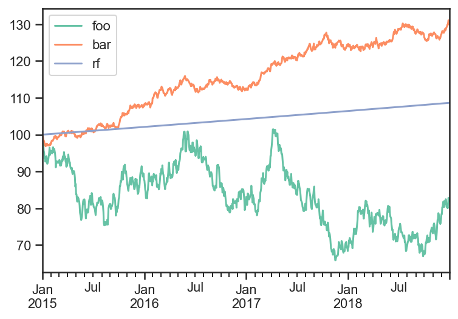
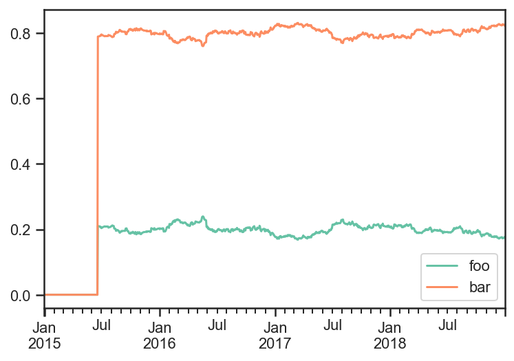
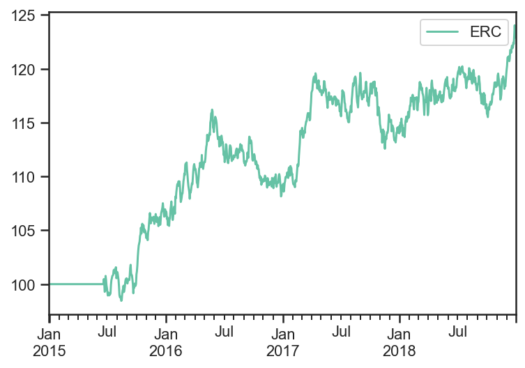
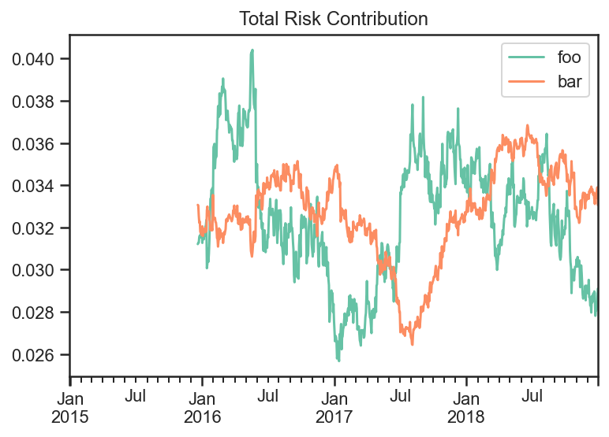

Equally Weighted Risk Contributions Portfolio
---------------------------------------------

.. code:: ipython3

    import numpy as np
    import pandas as pd
    import matplotlib.pyplot as plt
    
    import ffn
    import bt
    
    %matplotlib inline

Create Fake Index Data
~~~~~~~~~~~~~~~~~~~~~~

.. code:: ipython3

    mean = np.array([0.05/252 + 0.02/252, 0.03/252 + 0.02/252])
    volatility = np.array([0.2/np.sqrt(252), 0.05/np.sqrt(252)])
    variance = np.power(volatility,2)
    correlation = np.array(
        [
            [1, 0.25],
            [0.25,1]
        ]
    )
    covariance = np.zeros((2,2))
    for i in range(len(variance)):
        for j in range(len(variance)):
            covariance[i,j] = correlation[i,j]*volatility[i]*volatility[j]
    
    covariance

.. parsed-literal::
   :class: pynb-result

    array([[1.58730159e-04, 9.92063492e-06],
           [9.92063492e-06, 9.92063492e-06]])

.. code:: ipython3

    names = ['foo','bar','rf']
    dates = pd.date_range(start='2015-01-01',end='2018-12-31', freq=pd.tseries.offsets.BDay())
    n = len(dates)
    rdf = pd.DataFrame(
        np.zeros((n, len(names))),
        index = dates,
        columns = names
    )
    
    np.random.seed(1)
    rdf.loc[:,['foo','bar']] = np.random.multivariate_normal(mean,covariance,size=n)
    rdf['rf'] = 0.02/252
    
    pdf = 100*np.cumprod(1+rdf)
    pdf.plot();

Build and run ERC Strategy
~~~~~~~~~~~~~~~~~~~~~~~~~~

You can read more about ERC here.
http://thierry-roncalli.com/download/erc.pdf

.. code:: ipython3

    runAfterDaysAlgo = bt.algos.RunAfterDays(
        20*6 + 1
    )
    
    selectTheseAlgo = bt.algos.SelectThese(['foo','bar'])
    
    # algo to set the weights so each asset contributes the same amount of risk
    #  with data over the last 6 months excluding yesterday
    weighERCAlgo = bt.algos.WeighERC(
        lookback=pd.DateOffset(days=20*6),
        covar_method='standard',
        risk_parity_method='slsqp',
        maximum_iterations=1000,
        tolerance=1e-9,
        lag=pd.DateOffset(days=1)
    )
    
    rebalAlgo = bt.algos.Rebalance()
    
    strat = bt.Strategy(
        'ERC',
        [
            runAfterDaysAlgo,
            selectTheseAlgo,
            weighERCAlgo,
            rebalAlgo
        ]
    )
    
    backtest = bt.Backtest(
        strat,
        pdf,
        integer_positions=False
    )
    
    res_target = bt.run(backtest)

.. code:: ipython3

    res_target.get_security_weights().plot();

.. code:: ipython3

    res_target.prices.plot();

.. code:: ipython3

    weights_target = res_target.get_security_weights().copy()
    rolling_cov_target = pdf.loc[:,weights_target.columns].pct_change().rolling(window=252).cov()*252
    
    
    trc_target = pd.DataFrame(
        np.nan,
        index = weights_target.index,
        columns = weights_target.columns
    )
    
    for dt in pdf.index:
        trc_target.loc[dt,:] = weights_target.loc[dt,:].values*(rolling_cov_target.loc[dt,:].values@weights_target.loc[dt,:].values)/np.sqrt(weights_target.loc[dt,:].values@rolling_cov_target.loc[dt,:].values@weights_target.loc[dt,:].values)
    
    
    fig, ax = plt.subplots(nrows=1,ncols=1)
    trc_target.plot(ax=ax)
    ax.set_title('Total Risk Contribution')
    ax.plot();

You can see the Total Risk Contribution is roughly equal from both
assets.

