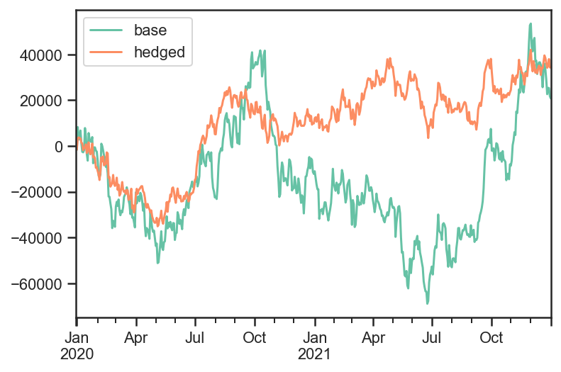
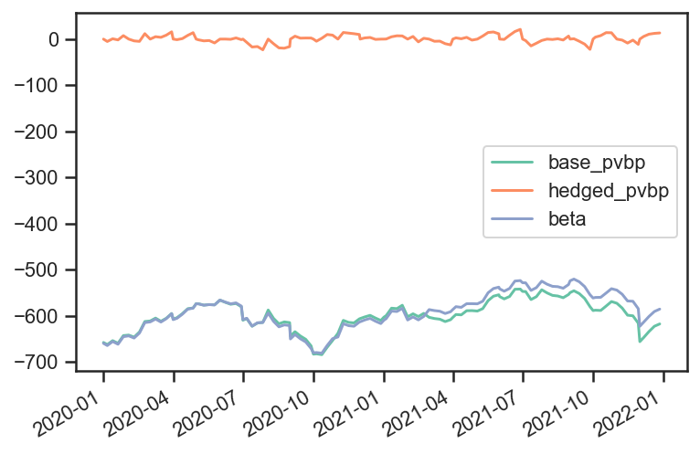
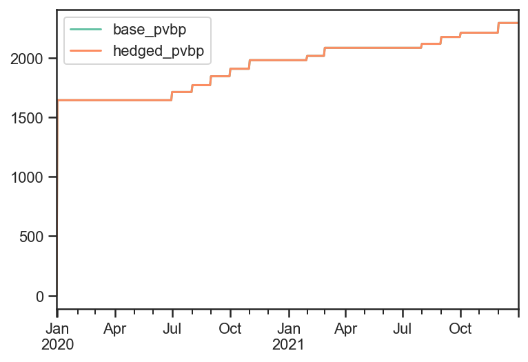
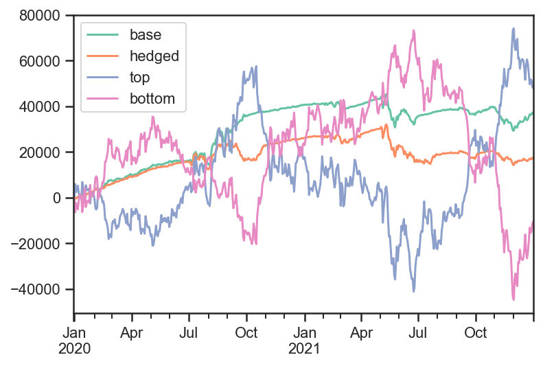
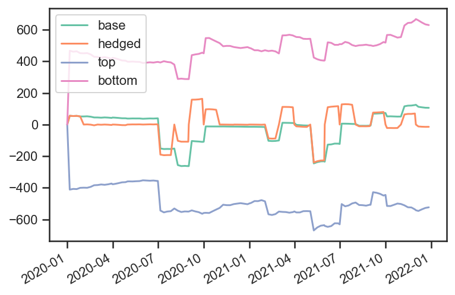
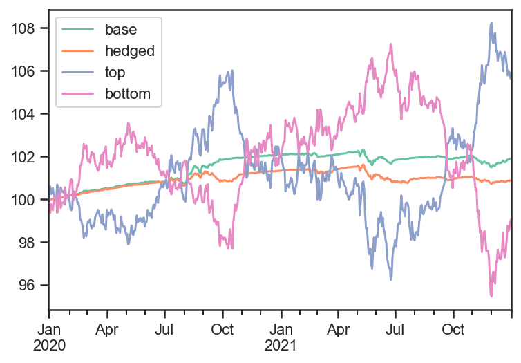

Fixed Income Examples
---------------------

This example notebook illustrates some of the more sophisticated
functionality of the package, especially related to fixed income
securities and strategies. For fixed income strategies:

-  capital allocations are not necessary, and initial capital is not
   used
-  bankruptcy is disabled (as money can always be borrowed at some rate,
   potentially represented as another asset)
-  weights are based off notional_value rather than value. For fixed
   income securities, notional value is just the position. For non-fixed
   income securities (i.e. equities), it is the market value of the
   position.
-  strategy notional_value is always positive, equal to the sum of the
   magnitudes of the notional values of all its children
-  strategy price is computed from additive PNL returns per unit of
   notional_value, with a reference price of PAR
-  “rebalancing” the portfolio adjusts notionals rather than capital
   allocations based on weights

Further to the above characteristics of fixed income strategies, we also
demonstrate the usage of the following features which arise in these
types of use case:

-  Coupon paying securities (i.e. bonds)
-  Handing of security lifecycle such as new issues and maturity
-  Usage of “On-The-Run” instruments, and rolling of positions into the
   “new” on-the-run security at pre-defined times
-  Risk tracking/aggregation and hedging from pre-computed risk per unit
   notional

The notebook contains the following parts:

0. **Setup**

1. **Market data generation**

   1. Rolling series of government bonds
   2. Corporate bonds with spreads driven by a common factor

2. **Example 1: Basic Strategies**

   1. Weigh all active corporate bond equally
   2. Add hedging of interest rates risk with the on-the-run government
      bond

3. **Example 2: Nested Strategies**

   1. One strategy buys the top N bonds, by yield
   2. Another strategy sells the bottom N bonds, by yield
   3. Parent strategy gives 50% weight to each of the above
   4. Add hedges of remaining interest rates risk with the on-the-run
      government bond

Setup
~~~~~

.. code:: ipython3

    import bt
    import pandas as pd
    from pandas.tseries.frequencies import to_offset
    import numpy as np
    np.random.seed(1234)
    %matplotlib inline

.. code:: ipython3

    # (Approximate) Price to yield calcs, and pvbp, for later use. Note we use clean price here.
    def price_to_yield( p, ttm, coupon ):
        return ( coupon + (100. - p)/ttm ) / ( ( 100. + p)/2. ) * 100
    def yield_to_price( y, ttm, coupon ):
        return (coupon + 100/ttm - 0.5 * y) / ( y/200 + 1/ttm)
    def pvbp( y, ttm, coupon ):
        return (yield_to_price( y + 0.01, ttm, coupon ) - yield_to_price( y, ttm, coupon ))

.. code:: ipython3

    # Utility function to set data frame values to nan before the security has been issued or after it has matured
    def censor( data, ref_data ):
        for bond in data:
            data.loc[ (data.index > ref_data['mat_date'][bond]) | (data.index < ref_data['issue_date'][bond]), bond] = np.nan
        return data.ffill(limit=1,axis=0) # Because bonds might mature during a gap in the index (i.e. on the weekend)

.. code:: ipython3

    # Backtesting timeline setup
    start_date = pd.Timestamp('2020-01-01')
    end_date = pd.Timestamp('2022-01-01')
    timeline = pd.date_range( start_date, end_date, freq='B')

Market Data Generation
~~~~~~~~~~~~~~~~~~~~~~

.. code:: ipython3

    # Government Bonds: Create synthetic data for a single series of rolling government bonds

    # Reference Data
    roll_freq = 'Q'
    maturity = 10
    coupon = 2.0
    roll_dates = pd.date_range( start_date, end_date+to_offset(roll_freq), freq=roll_freq) # Go one period beyond the end date to be safe
    issue_dates = roll_dates - roll_dates.freq
    mat_dates = issue_dates + pd.offsets.DateOffset(years=maturity)
    series_name = 'govt_10Y'
    names = pd.Series(mat_dates).apply( lambda x : 'govt_%s' % x.strftime('%Y_%m'))
    # Build a time series of OTR
    govt_otr = pd.DataFrame( [ [ name for name, roll_date in zip(names, roll_dates) if roll_date >=d ][0] for d in timeline ],
                            index=timeline,
                            columns=[series_name])
    # Create a data frame of reference data
    govt_data = pd.DataFrame( {'mat_date':mat_dates, 'issue_date': issue_dates, 'roll_date':roll_dates}, index = names)
    govt_data['coupon'] = coupon

    # Create the "roll map"
    govt_roll_map = govt_otr.copy()
    govt_roll_map['target'] = govt_otr[series_name].shift(-1)
    govt_roll_map = govt_roll_map[ govt_roll_map[series_name] != govt_roll_map['target']]
    govt_roll_map['factor'] = 1.
    govt_roll_map = govt_roll_map.reset_index().set_index(series_name).rename(columns={'index':'date'}).dropna()

    # Market Data and Risk
    govt_yield_initial = 2.0
    govt_yield_vol = 1.
    govt_yield = pd.DataFrame( columns = govt_data.index, index=timeline )
    govt_yield_ts = (govt_yield_initial + np.cumsum( np.random.normal( 0., govt_yield_vol/np.sqrt(252), len(timeline)))).reshape(-1,1)
    govt_yield.loc[:,:] = govt_yield_ts

    govt_mat = pd.DataFrame( columns = govt_data.index, index=timeline, data=pd.NA ).astype('datetime64')
    govt_mat.loc[:,:] = govt_data['mat_date'].values.T
    govt_ttm = (govt_mat - timeline.values.reshape(-1,1))/pd.Timedelta('1Y')
    govt_coupon = pd.DataFrame( columns = govt_data.index, index=timeline )
    govt_coupon.loc[:,:] = govt_data['coupon'].values.T
    govt_accrued = govt_coupon.multiply( timeline.to_series().diff()/pd.Timedelta('1Y'), axis=0 )
    govt_accrued.iloc[0] = 0

    govt_price = yield_to_price( govt_yield, govt_ttm, govt_coupon )
    govt_price[ govt_ttm <= 0 ] = 100.
    govt_price = censor(govt_price, govt_data)
    govt_pvbp = pvbp( govt_yield, govt_ttm, govt_coupon)
    govt_pvbp[ govt_ttm <= 0 ] = 0.
    govt_pvbp = censor(govt_pvbp, govt_data)

.. parsed-literal::
   :class: pynb-result

    /opt/homebrew/lib/python3.9/site-packages/IPython/core/interactiveshell.py:3397: FutureWarning: Units 'M', 'Y' and 'y' do not represent unambiguous timedelta values and will be removed in a future version
      exec(code_obj, self.user_global_ns, self.user_ns)

.. code:: ipython3

    # Corporate Bonds: Create synthetic data for a universe of corporate bonds

    # Reference Data
    n_corp = 50    # Number of corporate bonds to generate
    avg_ttm = 10   # Average time to maturity, in years
    coupon_mean = 5
    coupon_std = 1.5
    mat_dates = start_date + np.random.exponential(avg_ttm*365, n_corp).astype(int) * pd.offsets.Day()
    issue_dates = np.minimum( mat_dates, end_date ) - np.random.exponential(avg_ttm*365, n_corp).astype(int) * pd.offsets.Day()
    names = pd.Series( [ 'corp{:04d}'.format(i) for i in range(n_corp)])
    coupons = np.random.normal( coupon_mean, coupon_std, n_corp ).round(3)
    corp_data = pd.DataFrame( {'mat_date':mat_dates, 'issue_date': issue_dates, 'coupon':coupons}, index=names)

    # Market Data and Risk
    # Model: corporate yield = government yield + credit spread
    # Model: credit spread changes = beta * common factor changes + idiosyncratic changes
    corp_spread_initial = np.random.normal( 2, 1, len(corp_data) )
    corp_betas_raw = np.random.normal( 1, 0.5, len(corp_data) )
    corp_factor_vol = 0.5
    corp_idio_vol = 0.5
    corp_factor_ts = np.cumsum( np.random.normal( 0, corp_factor_vol/np.sqrt(252), len(timeline))).reshape(-1,1)
    corp_idio_ts = np.cumsum( np.random.normal( 0, corp_idio_vol/np.sqrt(252), len(timeline))).reshape(-1,1)
    corp_spread = corp_spread_initial + np.multiply( corp_factor_ts, corp_betas_raw ) + corp_idio_ts
    corp_yield = govt_yield_ts + corp_spread
    corp_yield = pd.DataFrame(  columns = corp_data.index, index=timeline, data = corp_yield )

    corp_mat = pd.DataFrame( columns = corp_data.index, index=timeline, data=start_date )
    corp_mat.loc[:,:] = corp_data['mat_date'].values.T
    corp_ttm = (corp_mat - timeline.values.reshape(-1,1))/pd.Timedelta('1Y')
    corp_coupon = pd.DataFrame( columns = corp_data.index, index=timeline )
    corp_coupon.loc[:,:] = corp_data['coupon'].values.T
    corp_accrued = corp_coupon.multiply( timeline.to_series().diff()/pd.Timedelta('1Y'), axis=0 )
    corp_accrued.iloc[0] = 0

    corp_price = yield_to_price( corp_yield, corp_ttm, corp_coupon )
    corp_price[ corp_ttm <= 0 ] = 100.
    corp_price = censor(corp_price, corp_data)

    corp_pvbp = pvbp( corp_yield, corp_ttm, corp_coupon)
    corp_pvbp[ corp_ttm <= 0 ] = 0.
    corp_pvbp = censor(corp_pvbp, corp_data)

    bidoffer_bps = 5.
    corp_bidoffer = -bidoffer_bps * corp_pvbp

    corp_betas = pd.DataFrame( columns = corp_data.index, index=timeline )
    corp_betas.loc[:,:] = corp_betas_raw
    corp_betas = censor(corp_betas, corp_data)

.. parsed-literal::
   :class: pynb-result

    /opt/homebrew/lib/python3.9/site-packages/IPython/core/interactiveshell.py:3397: FutureWarning: Units 'M', 'Y' and 'y' do not represent unambiguous timedelta values and will be removed in a future version
      exec(code_obj, self.user_global_ns, self.user_ns)

Example 1: Basic Strategies
~~~~~~~~~~~~~~~~~~~~~~~~~~~

.. code:: ipython3

    # Set up a strategy and a backtest

    # The goal here is to define an equal weighted portfolio of corporate bonds,
    # and to hedge the rates risk with the rolling series of government bonds

    # Define Algo Stacks as the various building blocks
    # Note that the order in which we execute these is extremely important

    lifecycle_stack = bt.core.AlgoStack(
        # Close any matured bond positions (including hedges)
        bt.algos.ClosePositionsAfterDates( 'maturity' ),
        # Roll government bond positions into the On The Run
        bt.algos.RollPositionsAfterDates( 'govt_roll_map' ),
    )
    risk_stack = bt.AlgoStack(
        # Specify how frequently to calculate risk
        bt.algos.Or( [bt.algos.RunWeekly(),
                      bt.algos.RunMonthly()] ),
        # Update the risk given any positions that have been put on so far in the current step
        bt.algos.UpdateRisk( 'pvbp', history=1),
        bt.algos.UpdateRisk( 'beta', history=1),
    )
    hedging_stack = bt.AlgoStack(
        # Specify how frequently to hedge risk
        bt.algos.RunMonthly(),
        # Select the "alias" for the on-the-run government bond...
        bt.algos.SelectThese( [series_name], include_no_data = True ),
        # ... and then resolve it to the underlying security for the given date
        bt.algos.ResolveOnTheRun( 'govt_otr' ),
        # Hedge out the pvbp risk using the selected government bond
        bt.algos.HedgeRisks( ['pvbp']),
        # Need to update risk again after hedging so that it gets recorded correctly (post-hedges)
        bt.algos.UpdateRisk( 'pvbp', history=True),
    )
    debug_stack = bt.core.AlgoStack(
        # Specify how frequently to display debug info
        bt.algos.RunMonthly(),
        bt.algos.PrintInfo('Strategy {name} : {now}.\tNotional:  {_notl_value:0.0f},\t Value: {_value:0.0f},\t Price: {_price:0.4f}'),
        bt.algos.PrintRisk('Risk: \tPVBP: {pvbp:0.0f},\t Beta: {beta:0.0f}'),
    )
    trading_stack =bt.core.AlgoStack(
             # Specify how frequently to rebalance the portfolio
             bt.algos.RunMonthly(),
             # Select instruments for rebalancing. Start with everything
             bt.algos.SelectAll(),
             # Prevent matured/rolled instruments from coming back into the mix
             bt.algos.SelectActive(),
             # Select only corp instruments
             bt.algos.SelectRegex( 'corp' ),
             # Specify how to weigh the securities
             bt.algos.WeighEqually(),
             # Set the target portfolio size
             bt.algos.SetNotional( 'notional_value' ),
             # Rebalance the portfolio
             bt.algos.Rebalance()
    )

    govt_securities = [ bt.CouponPayingHedgeSecurity( name ) for name in govt_data.index]
    corp_securities = [ bt.CouponPayingSecurity( name ) for name in corp_data.index ]
    securities = govt_securities + corp_securities
    base_strategy = bt.FixedIncomeStrategy('BaseStrategy', [ lifecycle_stack, bt.algos.Or( [trading_stack, risk_stack, debug_stack ] ) ], children = securities)
    hedged_strategy = bt.FixedIncomeStrategy('HedgedStrategy', [ lifecycle_stack, bt.algos.Or( [trading_stack, risk_stack, hedging_stack, debug_stack ] ) ], children = securities)

    #Collect all the data for the strategies

    # Here we use clean prices as the data and accrued as the coupon. Could alternatively use dirty prices and cashflows.
    data = pd.concat( [ govt_price, corp_price ], axis=1) / 100.  # Because we need prices per unit notional
    additional_data = { 'coupons' : pd.concat([govt_accrued, corp_accrued], axis=1) / 100.,
                       'bidoffer' : corp_bidoffer/100.,
                       'notional_value' : pd.Series( data=1e6, index=data.index ),
                       'maturity' : pd.concat([govt_data, corp_data], axis=0).rename(columns={"mat_date": "date"}),
                       'govt_roll_map' : govt_roll_map,
                       'govt_otr' : govt_otr,
                       'unit_risk' : {'pvbp' : pd.concat( [ govt_pvbp, corp_pvbp] ,axis=1)/100.,
                                      'beta' : corp_betas * corp_pvbp / 100.},
                      }
    base_test = bt.Backtest( base_strategy, data, 'BaseBacktest',
                    initial_capital = 0,
                    additional_data = additional_data )
    hedge_test = bt.Backtest( hedged_strategy, data, 'HedgedBacktest',
                    initial_capital = 0,
                    additional_data = additional_data)
    out = bt.run( base_test, hedge_test )

.. parsed-literal::
   :class: pynb-result

    Strategy BaseStrategy : 2020-01-01 00:00:00.	Notional:  1000000,	 Value: -1644,	 Price: 99.8356
    Risk: 	PVBP: -658,	 Beta: -659
    Strategy BaseStrategy : 2020-02-03 00:00:00.	Notional:  1000000,	 Value: -6454,	 Price: 99.3546
    Risk: 	PVBP: -642,	 Beta: -643
    Strategy BaseStrategy : 2020-03-02 00:00:00.	Notional:  1000000,	 Value: -26488,	 Price: 97.3512
    Risk: 	PVBP: -611,	 Beta: -613
    Strategy BaseStrategy : 2020-04-01 00:00:00.	Notional:  1000000,	 Value: -20295,	 Price: 97.9705
    Risk: 	PVBP: -607,	 Beta: -608
    Strategy BaseStrategy : 2020-05-01 00:00:00.	Notional:  1000000,	 Value: -43692,	 Price: 95.6308
    Risk: 	PVBP: -573,	 Beta: -574
    Strategy BaseStrategy : 2020-06-01 00:00:00.	Notional:  1000000,	 Value: -41095,	 Price: 95.8905
    Risk: 	PVBP: -566,	 Beta: -566
    Strategy BaseStrategy : 2020-07-01 00:00:00.	Notional:  1000000,	 Value: -15724,	 Price: 98.4985
    Risk: 	PVBP: -609,	 Beta: -608
    Strategy BaseStrategy : 2020-08-03 00:00:00.	Notional:  1000000,	 Value: -22308,	 Price: 97.8400
    Risk: 	PVBP: -587,	 Beta: -594
    Strategy BaseStrategy : 2020-09-01 00:00:00.	Notional:  1000000,	 Value: 12832,	 Price: 101.4263
    Risk: 	PVBP: -644,	 Beta: -650
    Strategy BaseStrategy : 2020-10-01 00:00:00.	Notional:  1000000,	 Value: 35263,	 Price: 103.6965
    Risk: 	PVBP: -683,	 Beta: -680
    Strategy BaseStrategy : 2020-11-02 00:00:00.	Notional:  1000000,	 Value: 3702,	 Price: 100.5404
    Risk: 	PVBP: -638,	 Beta: -646
    Strategy BaseStrategy : 2020-12-01 00:00:00.	Notional:  1000000,	 Value: -18534,	 Price: 98.3168
    Risk: 	PVBP: -606,	 Beta: -613
    Strategy BaseStrategy : 2021-01-01 00:00:00.	Notional:  1000000,	 Value: -11054,	 Price: 99.0648
    Risk: 	PVBP: -603,	 Beta: -609
    Strategy BaseStrategy : 2021-02-01 00:00:00.	Notional:  1000000,	 Value: -16424,	 Price: 98.5537
    Risk: 	PVBP: -602,	 Beta: -609
    Strategy BaseStrategy : 2021-03-01 00:00:00.	Notional:  1000000,	 Value: -34462,	 Price: 96.6943
    Risk: 	PVBP: -603,	 Beta: -586
    Strategy BaseStrategy : 2021-04-01 00:00:00.	Notional:  1000000,	 Value: -23533,	 Price: 97.7872
    Risk: 	PVBP: -603,	 Beta: -586
    Strategy BaseStrategy : 2021-05-03 00:00:00.	Notional:  1000000,	 Value: -27024,	 Price: 97.4381
    Risk: 	PVBP: -590,	 Beta: -574
    Strategy BaseStrategy : 2021-06-01 00:00:00.	Notional:  1000000,	 Value: -50723,	 Price: 95.0682
    Risk: 	PVBP: -558,	 Beta: -541
    Strategy BaseStrategy : 2021-07-01 00:00:00.	Notional:  1000000,	 Value: -52714,	 Price: 94.8690
    Risk: 	PVBP: -547,	 Beta: -528
    Strategy BaseStrategy : 2021-08-02 00:00:00.	Notional:  1000000,	 Value: -53039,	 Price: 94.8067
    Risk: 	PVBP: -550,	 Beta: -531
    Strategy BaseStrategy : 2021-09-01 00:00:00.	Notional:  1000000,	 Value: -39027,	 Price: 96.2079
    Risk: 	PVBP: -550,	 Beta: -524
    Strategy BaseStrategy : 2021-10-01 00:00:00.	Notional:  1000000,	 Value: -2051,	 Price: 99.9002
    Risk: 	PVBP: -588,	 Beta: -561
    Strategy BaseStrategy : 2021-11-01 00:00:00.	Notional:  1000000,	 Value: -8616,	 Price: 99.2438
    Risk: 	PVBP: -573,	 Beta: -544
    Strategy BaseStrategy : 2021-12-01 00:00:00.	Notional:  1000000,	 Value: 53520,	 Price: 105.6538
    Risk: 	PVBP: -656,	 Beta: -623
    Strategy HedgedStrategy : 2020-01-01 00:00:00.	Notional:  1000000,	 Value: -1644,	 Price: 99.8356
    Risk: 	PVBP: 0,	 Beta: -659
    Strategy HedgedStrategy : 2020-02-03 00:00:00.	Notional:  1000000,	 Value: -10996,	 Price: 98.9004
    Risk: 	PVBP: 0,	 Beta: -643
    Strategy HedgedStrategy : 2020-03-02 00:00:00.	Notional:  1000000,	 Value: -16765,	 Price: 98.3235
    Risk: 	PVBP: 0,	 Beta: -613
    Strategy HedgedStrategy : 2020-04-01 00:00:00.	Notional:  1000000,	 Value: -21649,	 Price: 97.8351
    Risk: 	PVBP: -0,	 Beta: -608
    Strategy HedgedStrategy : 2020-05-01 00:00:00.	Notional:  1000000,	 Value: -33399,	 Price: 96.6601
    Risk: 	PVBP: 0,	 Beta: -574
    Strategy HedgedStrategy : 2020-06-01 00:00:00.	Notional:  1000000,	 Value: -22927,	 Price: 97.7073
    Risk: 	PVBP: -0,	 Beta: -566
    Strategy HedgedStrategy : 2020-07-01 00:00:00.	Notional:  1000000,	 Value: -14965,	 Price: 98.5366
    Risk: 	PVBP: -0,	 Beta: -608
    Strategy HedgedStrategy : 2020-08-03 00:00:00.	Notional:  1000000,	 Value: 5092,	 Price: 100.5423
    Risk: 	PVBP: -0,	 Beta: -594
    Strategy HedgedStrategy : 2020-09-01 00:00:00.	Notional:  1000000,	 Value: 22278,	 Price: 102.2828
    Risk: 	PVBP: 0,	 Beta: -650
    Strategy HedgedStrategy : 2020-10-01 00:00:00.	Notional:  1000000,	 Value: 13903,	 Price: 101.4286
    Risk: 	PVBP: -0,	 Beta: -680
    Strategy HedgedStrategy : 2020-11-02 00:00:00.	Notional:  1000000,	 Value: 12081,	 Price: 101.2464
    Risk: 	PVBP: -0,	 Beta: -646
    Strategy HedgedStrategy : 2020-12-01 00:00:00.	Notional:  1000000,	 Value: 10531,	 Price: 101.0914
    Risk: 	PVBP: -0,	 Beta: -613
    Strategy HedgedStrategy : 2021-01-01 00:00:00.	Notional:  1000000,	 Value: 12144,	 Price: 101.2528
    Risk: 	PVBP: 0,	 Beta: -609
    Strategy HedgedStrategy : 2021-02-01 00:00:00.	Notional:  1000000,	 Value: 15903,	 Price: 101.6469
    Risk: 	PVBP: -0,	 Beta: -609
    Strategy HedgedStrategy : 2021-03-01 00:00:00.	Notional:  1000000,	 Value: 11958,	 Price: 101.2204
    Risk: 	PVBP: 0,	 Beta: -586
    Strategy HedgedStrategy : 2021-04-01 00:00:00.	Notional:  1000000,	 Value: 28170,	 Price: 102.8417
    Risk: 	PVBP: -0,	 Beta: -586
    Strategy HedgedStrategy : 2021-05-03 00:00:00.	Notional:  1000000,	 Value: 34561,	 Price: 103.4807
    Risk: 	PVBP: 0,	 Beta: -574
    Strategy HedgedStrategy : 2021-06-01 00:00:00.	Notional:  1000000,	 Value: 29233,	 Price: 102.9479
    Risk: 	PVBP: -0,	 Beta: -541
    Strategy HedgedStrategy : 2021-07-01 00:00:00.	Notional:  1000000,	 Value: 10323,	 Price: 101.0569
    Risk: 	PVBP: 0,	 Beta: -528
    Strategy HedgedStrategy : 2021-08-02 00:00:00.	Notional:  1000000,	 Value: 14539,	 Price: 101.4646
    Risk: 	PVBP: 0,	 Beta: -531
    Strategy HedgedStrategy : 2021-09-01 00:00:00.	Notional:  1000000,	 Value: 10754,	 Price: 101.0860
    Risk: 	PVBP: 0,	 Beta: -524
    Strategy HedgedStrategy : 2021-10-01 00:00:00.	Notional:  1000000,	 Value: 32502,	 Price: 103.2515
    Risk: 	PVBP: -0,	 Beta: -561
    Strategy HedgedStrategy : 2021-11-01 00:00:00.	Notional:  1000000,	 Value: 24506,	 Price: 102.4519
    Risk: 	PVBP: -0,	 Beta: -544
    Strategy HedgedStrategy : 2021-12-01 00:00:00.	Notional:  1000000,	 Value: 42093,	 Price: 104.2905
    Risk: 	PVBP: -0,	 Beta: -623

.. code:: ipython3

    # Extract Tear Sheet for base backtest
    stats = out['BaseBacktest']
    stats.display()

.. parsed-literal::
   :class: pynb-result

    Stats for BaseBacktest from 2019-12-31 00:00:00 - 2021-12-31 00:00:00
    Annual risk-free rate considered: 0.00%
    Summary:
    Total Return      Sharpe  CAGR    Max Drawdown
    --------------  --------  ------  --------------
    2.34%               0.19  1.16%   -10.64%

    Annualized Returns:
    mtd     3m     6m     ytd    1y     3y     5y    10y    incep.
    ------  -----  -----  -----  -----  -----  ----  -----  --------
    -3.06%  1.45%  8.12%  3.43%  3.43%  1.16%  -     -      1.16%

    Periodic:
            daily    monthly    yearly
    ------  -------  ---------  --------
    sharpe  0.19     0.18       0.38
    mean    1.38%    1.49%      1.19%
    vol     7.26%    8.35%      3.17%
    skew    0.16     0.75       -
    kurt    0.52     0.70       -
    best    1.59%    6.32%      3.43%
    worst   -1.44%   -3.29%     -1.05%

    Drawdowns:
    max      avg       # days
    -------  ------  --------
    -10.64%  -2.59%     79.22

    Misc:
    ---------------  ------
    avg. up month    1.88%
    avg. down month  -1.63%
    up year %        50.00%
    12m up %         57.14%
    ---------------  ------

.. code:: ipython3

    # Extract Tear Sheet for hedged backtest
    stats = out['HedgedBacktest']
    stats.display()

.. parsed-literal::
   :class: pynb-result

    Stats for HedgedBacktest from 2019-12-31 00:00:00 - 2021-12-31 00:00:00
    Annual risk-free rate considered: 0.00%
    Summary:
    Total Return      Sharpe  CAGR    Max Drawdown
    --------------  --------  ------  --------------
    3.51%               0.41  1.74%   -3.87%

    Annualized Returns:
    mtd     3m      6m     ytd    1y     3y     5y    10y    incep.
    ------  ------  -----  -----  -----  -----  ----  -----  --------
    -0.47%  -0.30%  2.29%  2.46%  2.46%  1.74%  -     -      1.74%

    Periodic:
            daily    monthly    yearly
    ------  -------  ---------  --------
    sharpe  0.41     0.43       1.71
    mean    1.75%    1.81%      1.74%
    vol     4.26%    4.22%      1.02%
    skew    -0.17    0.67       -
    kurt    0.21     -0.46      -
    best    0.69%    2.82%      2.46%
    worst   -1.07%   -1.62%     1.02%

    Drawdowns:
    max     avg       # days
    ------  ------  --------
    -3.87%  -1.02%     49.57

    Misc:
    ---------------  -------
    avg. up month    1.25%
    avg. down month  -0.78%
    up year %        100.00%
    12m up %         85.71%
    ---------------  -------

.. code:: ipython3

    # Total PNL time series values
    pd.DataFrame( {'base':base_test.strategy.values, 'hedged':hedge_test.strategy.values} ).plot();

.. code:: ipython3

    # Total risk time series values
    pd.DataFrame( {'base_pvbp':base_test.strategy.risks['pvbp'],
                   'hedged_pvbp':hedge_test.strategy.risks['pvbp'],
                   'beta':hedge_test.strategy.risks['beta']} ).dropna().plot();

.. code:: ipython3

    # Total bid/offer paid (same for both strategies)
    pd.DataFrame( {'base_pvbp':base_test.strategy.bidoffers_paid,
                   'hedged_pvbp':hedge_test.strategy.bidoffers_paid }).cumsum().dropna().plot();

Example 2: Nested Strategies
~~~~~~~~~~~~~~~~~~~~~~~~~~~~

.. code:: ipython3

    # Set up a more complex strategy and a backtest

    # The goal of the more complex strategy is to define two sub-strategies of corporate bonds
    # - Highest yield bonds
    # - Lowest yield bonds
    # Then we will go long the high yield bonds, short the low yield bonds in equal weight
    # Lastly we will hedge the rates risk with the government bond

    govt_securities = [ bt.CouponPayingHedgeSecurity( name ) for name in govt_data.index]
    corp_securities = [ bt.CouponPayingSecurity( name ) for name in corp_data.index ]

    def get_algos( n, sort_descending ):
        ''' Helper function to return the algos for long or short portfolio, based on top n yields'''
        return [
            # Close any matured bond positions
            bt.algos.ClosePositionsAfterDates( 'corp_maturity' ),
            # Specify how frequenty to rebalance
            bt.algos.RunMonthly(),
            # Select instruments for rebalancing. Start with everything
            bt.algos.SelectAll(),
            # Prevent matured/rolled instruments from coming back into the mix
            bt.algos.SelectActive(),
            # Set the stat to be used for selection
            bt.algos.SetStat( 'corp_yield' ),
            # Select the top N yielding bonds
            bt.algos.SelectN( n, sort_descending, filter_selected=True ),
            # Specify how to weigh the securities
            bt.algos.WeighEqually(),
            bt.algos.ScaleWeights(1. if sort_descending else -1.), # Determine long/short
            # Set the target portfolio size
            bt.algos.SetNotional( 'notional_value' ),
            # Rebalance the portfolio
            bt.algos.Rebalance(),
        ]
    bottom_algos = []
    top_strategy = bt.FixedIncomeStrategy('TopStrategy', get_algos( 10, True ), children = corp_securities)
    bottom_strategy = bt.FixedIncomeStrategy('BottomStrategy',get_algos( 10, False ), children = corp_securities)

    risk_stack = bt.AlgoStack(
        # Specify how frequently to calculate risk
        bt.algos.Or( [bt.algos.RunWeekly(),
                      bt.algos.RunMonthly()] ),
        # Update the risk given any positions that have been put on so far in the current step
        bt.algos.UpdateRisk( 'pvbp', history=2),
        bt.algos.UpdateRisk( 'beta', history=2),
    )
    hedging_stack = bt.AlgoStack(
        # Close any matured hedge positions (including hedges)
        bt.algos.ClosePositionsAfterDates( 'govt_maturity' ),
        # Roll government bond positions into the On The Run
        bt.algos.RollPositionsAfterDates( 'govt_roll_map' ),
        # Specify how frequently to hedge risk
        bt.algos.RunMonthly(),
        # Select the "alias" for the on-the-run government bond...
        bt.algos.SelectThese( [series_name], include_no_data = True ),
        # ... and then resolve it to the underlying security for the given date
        bt.algos.ResolveOnTheRun( 'govt_otr' ),
        # Hedge out the pvbp risk using the selected government bond
        bt.algos.HedgeRisks( ['pvbp']),
        # Need to update risk again after hedging so that it gets recorded correctly (post-hedges)
        bt.algos.UpdateRisk( 'pvbp', history=2),
    )
    debug_stack = bt.core.AlgoStack(
        # Specify how frequently to display debug info
        bt.algos.RunMonthly(),
        bt.algos.PrintInfo('{now}: End   {name}\tNotional:  {_notl_value:0.0f},\t Value: {_value:0.0f},\t Price: {_price:0.4f}'),
        bt.algos.PrintRisk('Risk: \tPVBP: {pvbp:0.0f},\t Beta: {beta:0.0f}'),
    )
    trading_stack =bt.core.AlgoStack(
        # Specify how frequently to rebalance the portfolio of sub-strategies
        bt.algos.RunOnce(),
        # Specify how to weigh the sub-strategies
        bt.algos.WeighSpecified( TopStrategy=0.5, BottomStrategy=-0.5),
        # Rebalance the portfolio
        bt.algos.Rebalance()
    )

    children = [ top_strategy, bottom_strategy ] + govt_securities
    base_strategy = bt.FixedIncomeStrategy('BaseStrategy', [ bt.algos.Or( [trading_stack, risk_stack, debug_stack ] ) ], children = children)
    hedged_strategy = bt.FixedIncomeStrategy('HedgedStrategy', [ bt.algos.Or( [trading_stack, risk_stack, hedging_stack, debug_stack ] ) ], children = children)

    # Here we use clean prices as the data and accrued as the coupon. Could alternatively use dirty prices and cashflows.
    data = pd.concat( [ govt_price, corp_price ], axis=1) / 100.  # Because we need prices per unit notional
    additional_data = { 'coupons' : pd.concat([govt_accrued, corp_accrued], axis=1) / 100., # Because we need coupons per unit notional
                       'notional_value' : pd.Series( data=1e6, index=data.index ),
                       'govt_maturity' : govt_data.rename(columns={"mat_date": "date"}),
                       'corp_maturity' : corp_data.rename(columns={"mat_date": "date"}),
                       'govt_roll_map' : govt_roll_map,
                       'govt_otr' : govt_otr,
                       'corp_yield' : corp_yield,
                       'unit_risk' : {'pvbp' : pd.concat( [ govt_pvbp, corp_pvbp] ,axis=1)/100.,
                                      'beta' : corp_betas * corp_pvbp / 100.},
                      }
    base_test = bt.Backtest( base_strategy, data, 'BaseBacktest',
                    initial_capital = 0,
                    additional_data = additional_data)
    hedge_test = bt.Backtest( hedged_strategy, data, 'HedgedBacktest',
                    initial_capital = 0,
                    additional_data = additional_data)
    out = bt.run( base_test, hedge_test )

.. parsed-literal::
   :class: pynb-result

    2020-01-01 00:00:00: End   BaseStrategy	Notional:  0,	 Value: 0,	 Price: 100.0000
    Risk: 	PVBP: 0,	 Beta: 0
    2020-02-03 00:00:00: End   BaseStrategy	Notional:  2000000,	 Value: 3277,	 Price: 100.1639
    Risk: 	PVBP: 51,	 Beta: 41
    2020-03-02 00:00:00: End   BaseStrategy	Notional:  2000000,	 Value: 7297,	 Price: 100.3649
    Risk: 	PVBP: 45,	 Beta: 34
    2020-04-01 00:00:00: End   BaseStrategy	Notional:  2000000,	 Value: 9336,	 Price: 100.4668
    Risk: 	PVBP: 44,	 Beta: 34
    2020-05-01 00:00:00: End   BaseStrategy	Notional:  2000000,	 Value: 13453,	 Price: 100.6727
    Risk: 	PVBP: 38,	 Beta: 28
    2020-06-01 00:00:00: End   BaseStrategy	Notional:  2000000,	 Value: 15887,	 Price: 100.7943
    Risk: 	PVBP: 37,	 Beta: 26
    2020-07-01 00:00:00: End   BaseStrategy	Notional:  1800000,	 Value: 16024,	 Price: 100.8010
    Risk: 	PVBP: 39,	 Beta: 28
    2020-08-03 00:00:00: End   BaseStrategy	Notional:  2000000,	 Value: 14785,	 Price: 100.7391
    Risk: 	PVBP: -152,	 Beta: -124
    2020-09-01 00:00:00: End   BaseStrategy	Notional:  1800000,	 Value: 30310,	 Price: 101.5550
    Risk: 	PVBP: -263,	 Beta: -204
    2020-10-01 00:00:00: End   BaseStrategy	Notional:  1900000,	 Value: 35915,	 Price: 101.8430
    Risk: 	PVBP: -109,	 Beta: -53
    2020-11-02 00:00:00: End   BaseStrategy	Notional:  2000000,	 Value: 37649,	 Price: 101.9297
    Risk: 	PVBP: -12,	 Beta: 36
    2020-12-01 00:00:00: End   BaseStrategy	Notional:  2000000,	 Value: 39045,	 Price: 101.9995
    Risk: 	PVBP: -13,	 Beta: 34
    2021-01-01 00:00:00: End   BaseStrategy	Notional:  2000000,	 Value: 40569,	 Price: 102.0758
    Risk: 	PVBP: -14,	 Beta: 31
    2021-02-01 00:00:00: End   BaseStrategy	Notional:  1900000,	 Value: 41228,	 Price: 102.1094
    Risk: 	PVBP: -16,	 Beta: 27
    2021-03-01 00:00:00: End   BaseStrategy	Notional:  1900000,	 Value: 38916,	 Price: 101.9868
    Risk: 	PVBP: -101,	 Beta: -47
    2021-04-01 00:00:00: End   BaseStrategy	Notional:  2000000,	 Value: 40755,	 Price: 102.0788
    Risk: 	PVBP: 9,	 Beta: -31
    2021-05-03 00:00:00: End   BaseStrategy	Notional:  2000000,	 Value: 43290,	 Price: 102.2055
    Risk: 	PVBP: -6,	 Beta: -43
    2021-06-01 00:00:00: End   BaseStrategy	Notional:  2000000,	 Value: 35947,	 Price: 101.8384
    Risk: 	PVBP: -235,	 Beta: -91
    2021-07-01 00:00:00: End   BaseStrategy	Notional:  2000000,	 Value: 35671,	 Price: 101.8246
    Risk: 	PVBP: -123,	 Beta: -129
    2021-08-02 00:00:00: End   BaseStrategy	Notional:  2000000,	 Value: 37756,	 Price: 101.9288
    Risk: 	PVBP: 3,	 Beta: -29
    2021-09-01 00:00:00: End   BaseStrategy	Notional:  2000000,	 Value: 38434,	 Price: 101.9627
    Risk: 	PVBP: -7,	 Beta: -43
    2021-10-01 00:00:00: End   BaseStrategy	Notional:  1900000,	 Value: 37082,	 Price: 101.8966
    Risk: 	PVBP: 73,	 Beta: 19
    2021-11-01 00:00:00: End   BaseStrategy	Notional:  2000000,	 Value: 39526,	 Price: 102.0187
    Risk: 	PVBP: 51,	 Beta: 53
    2021-12-01 00:00:00: End   BaseStrategy	Notional:  1900000,	 Value: 29228,	 Price: 101.4826
    Risk: 	PVBP: 125,	 Beta: 97
    2020-01-01 00:00:00: End   HedgedStrategy	Notional:  0,	 Value: 0,	 Price: 100.0000
    Risk: 	PVBP: 0,	 Beta: 0
    2020-02-03 00:00:00: End   HedgedStrategy	Notional:  2000000,	 Value: 3277,	 Price: 100.1639
    Risk: 	PVBP: 0,	 Beta: 41
    2020-03-02 00:00:00: End   HedgedStrategy	Notional:  2000000,	 Value: 6159,	 Price: 100.3079
    Risk: 	PVBP: 0,	 Beta: 34
    2020-04-01 00:00:00: End   HedgedStrategy	Notional:  2000000,	 Value: 9008,	 Price: 100.4504
    Risk: 	PVBP: 0,	 Beta: 34
    2020-05-01 00:00:00: End   HedgedStrategy	Notional:  2000000,	 Value: 12274,	 Price: 100.6137
    Risk: 	PVBP: 0,	 Beta: 28
    2020-06-01 00:00:00: End   HedgedStrategy	Notional:  2000000,	 Value: 14189,	 Price: 100.7094
    Risk: 	PVBP: 0,	 Beta: 26
    2020-07-01 00:00:00: End   HedgedStrategy	Notional:  1800000,	 Value: 15451,	 Price: 100.7752
    Risk: 	PVBP: 0,	 Beta: 28
    2020-08-03 00:00:00: End   HedgedStrategy	Notional:  2000000,	 Value: 12494,	 Price: 100.6273
    Risk: 	PVBP: 0,	 Beta: -124
    2020-09-01 00:00:00: End   HedgedStrategy	Notional:  1800000,	 Value: 23384,	 Price: 101.1967
    Risk: 	PVBP: 0,	 Beta: -204
    2020-10-01 00:00:00: End   HedgedStrategy	Notional:  1900000,	 Value: 16414,	 Price: 100.8372
    Risk: 	PVBP: -0,	 Beta: -53
    2020-11-02 00:00:00: End   HedgedStrategy	Notional:  2000000,	 Value: 22887,	 Price: 101.1609
    Risk: 	PVBP: 0,	 Beta: 36
    2020-12-01 00:00:00: End   HedgedStrategy	Notional:  2000000,	 Value: 24681,	 Price: 101.2506
    Risk: 	PVBP: 0,	 Beta: 34
    2021-01-01 00:00:00: End   HedgedStrategy	Notional:  2000000,	 Value: 26080,	 Price: 101.3205
    Risk: 	PVBP: -0,	 Beta: 31
    2021-02-01 00:00:00: End   HedgedStrategy	Notional:  1900000,	 Value: 26954,	 Price: 101.3647
    Risk: 	PVBP: 0,	 Beta: 27
    2021-03-01 00:00:00: End   HedgedStrategy	Notional:  1900000,	 Value: 25008,	 Price: 101.2611
    Risk: 	PVBP: 0,	 Beta: -47
    2021-04-01 00:00:00: End   HedgedStrategy	Notional:  2000000,	 Value: 27730,	 Price: 101.3972
    Risk: 	PVBP: 0,	 Beta: -31
    2021-05-03 00:00:00: End   HedgedStrategy	Notional:  2000000,	 Value: 30112,	 Price: 101.5163
    Risk: 	PVBP: 0,	 Beta: -43
    2021-06-01 00:00:00: End   HedgedStrategy	Notional:  2000000,	 Value: 22951,	 Price: 101.1582
    Risk: 	PVBP: -0,	 Beta: -91
    2021-07-01 00:00:00: End   HedgedStrategy	Notional:  2000000,	 Value: 15553,	 Price: 100.7884
    Risk: 	PVBP: 0,	 Beta: -129
    2021-08-02 00:00:00: End   HedgedStrategy	Notional:  2000000,	 Value: 18657,	 Price: 100.9436
    Risk: 	PVBP: 0,	 Beta: -29
    2021-09-01 00:00:00: End   HedgedStrategy	Notional:  2000000,	 Value: 19441,	 Price: 100.9827
    Risk: 	PVBP: 0,	 Beta: -43
    2021-10-01 00:00:00: End   HedgedStrategy	Notional:  1900000,	 Value: 17903,	 Price: 100.9072
    Risk: 	PVBP: 0,	 Beta: 19
    2021-11-01 00:00:00: End   HedgedStrategy	Notional:  2000000,	 Value: 20524,	 Price: 101.0383
    Risk: 	PVBP: 0,	 Beta: 53
    2021-12-01 00:00:00: End   HedgedStrategy	Notional:  1900000,	 Value: 14170,	 Price: 100.7071
    Risk: 	PVBP: 0,	 Beta: 97

.. code:: ipython3

    # Total PNL time series values
    pd.DataFrame( {'base':base_test.strategy.values,
                   'hedged':hedge_test.strategy.values,
                   'top':base_test.strategy['TopStrategy'].values,
                   'bottom':base_test.strategy['BottomStrategy'].values}
                ).plot();

.. code:: ipython3

    # Total pvbp time series values
    pd.DataFrame( {'base':base_test.strategy.risks['pvbp'],
                   'hedged':hedge_test.strategy.risks['pvbp'],
                   'top':base_test.strategy['TopStrategy'].risks['pvbp'],
                   'bottom':base_test.strategy['BottomStrategy'].risks['pvbp']}
                ).dropna().plot();

.. code:: ipython3

    # Total beta time series values
    pd.DataFrame( {'base':base_test.strategy.risks['beta'],
                   'hedged':hedge_test.strategy.risks['beta'],
                   'top':base_test.strategy['TopStrategy'].risks['beta'],
                   'bottom':base_test.strategy['BottomStrategy'].risks['beta']}
                ).dropna().plot();

.. image:: _static/Fixed_Income_20_0.png
   :class: pynb
   :width: 383px
   :height: 248px

.. code:: ipython3

    # "Price" time series values
    pd.DataFrame( {'base':base_test.strategy.prices,
                   'hedged':hedge_test.strategy.prices,
                   'top':base_test.strategy['TopStrategy'].prices,
                   'bottom':base_test.strategy['BottomStrategy'].prices}
                ).plot();

.. code:: ipython3

    # Show transactions
    out.get_transactions('HedgedBacktest').head(20)

.. raw:: html

    

    
    <table border="1" class="dataframe">
      <thead>
        <tr style="text-align: right;">
          <th></th>
          <th></th>
          <th>price</th>
          <th>quantity</th>
        </tr>
        <tr>
          <th>Date</th>
          <th>Security</th>
          <th></th>
          <th></th>
        </tr>
      </thead>
      <tbody>
        <tr>
          <th rowspan="20" valign="top">2020-01-01</th>
          <th>corp0000</th>
          <td>1.009697</td>
          <td>-100000.0</td>
        </tr>
        <tr>
          <th>corp0001</th>
          <td>0.991417</td>
          <td>100000.0</td>
        </tr>
        <tr>
          <th>corp0002</th>
          <td>1.016553</td>
          <td>-100000.0</td>
        </tr>
        <tr>
          <th>corp0005</th>
          <td>1.035779</td>
          <td>-100000.0</td>
        </tr>
        <tr>
          <th>corp0009</th>
          <td>1.014195</td>
          <td>100000.0</td>
        </tr>
        <tr>
          <th>corp0015</th>
          <td>0.849097</td>
          <td>100000.0</td>
        </tr>
        <tr>
          <th>corp0017</th>
          <td>1.018107</td>
          <td>-100000.0</td>
        </tr>
        <tr>
          <th>corp0018</th>
          <td>1.009549</td>
          <td>100000.0</td>
        </tr>
        <tr>
          <th>corp0019</th>
          <td>0.908531</td>
          <td>100000.0</td>
        </tr>
        <tr>
          <th>corp0023</th>
          <td>1.216847</td>
          <td>100000.0</td>
        </tr>
        <tr>
          <th>corp0024</th>
          <td>1.094375</td>
          <td>-100000.0</td>
        </tr>
        <tr>
          <th>corp0025</th>
          <td>1.054762</td>
          <td>-100000.0</td>
        </tr>
        <tr>
          <th>corp0030</th>
          <td>0.888091</td>
          <td>100000.0</td>
        </tr>
        <tr>
          <th>corp0032</th>
          <td>1.086487</td>
          <td>-100000.0</td>
        </tr>
        <tr>
          <th>corp0035</th>
          <td>0.996676</td>
          <td>100000.0</td>
        </tr>
        <tr>
          <th>corp0036</th>
          <td>1.070212</td>
          <td>-100000.0</td>
        </tr>
        <tr>
          <th>corp0037</th>
          <td>0.992530</td>
          <td>100000.0</td>
        </tr>
        <tr>
          <th>corp0044</th>
          <td>0.959150</td>
          <td>100000.0</td>
        </tr>
        <tr>
          <th>corp0048</th>
          <td>0.987408</td>
          <td>-100000.0</td>
        </tr>
        <tr>
          <th>corp0049</th>
          <td>1.016879</td>
          <td>-100000.0</td>
        </tr>
      </tbody>
    </table>
    

