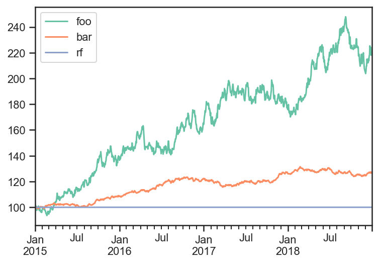
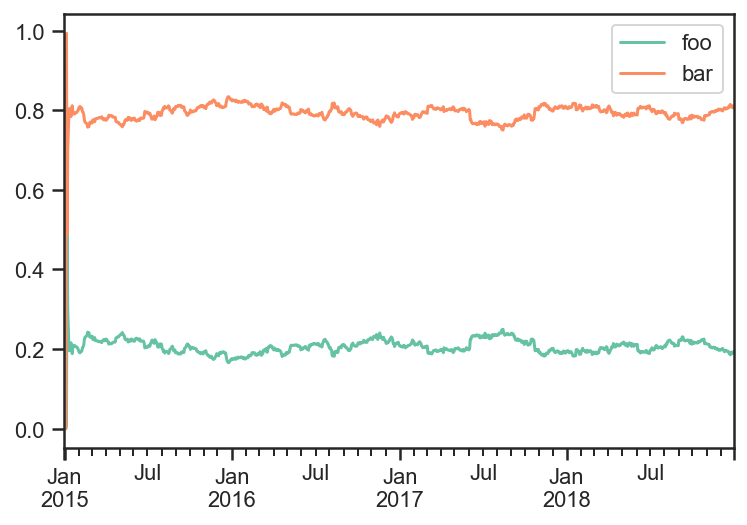
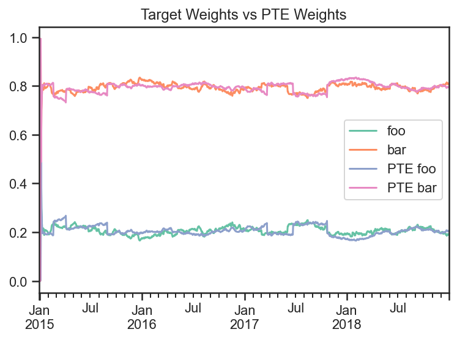
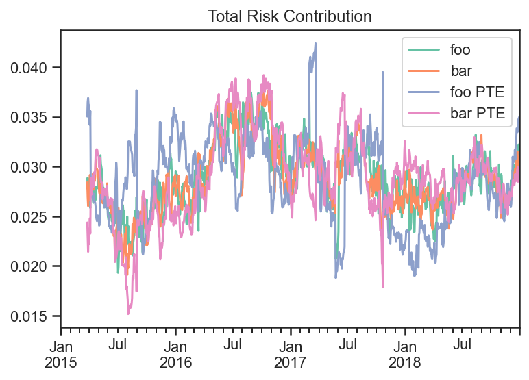
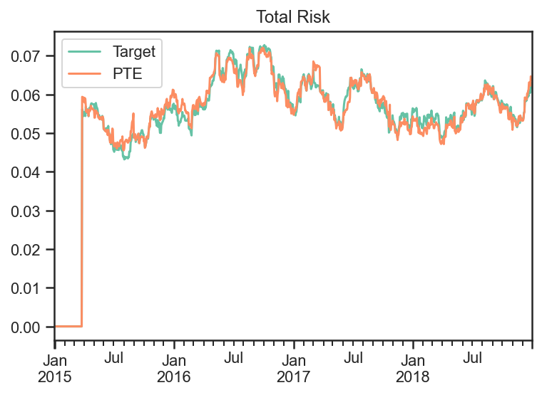

Predicted Tracking Error Rebalance Portfolio
--------------------------------------------

.. code:: ipython3

    import numpy as np
    import pandas as pd
    import matplotlib.pyplot as plt
    
    import ffn
    import bt
    
    %matplotlib inline

Create Fake Index Data
~~~~~~~~~~~~~~~~~~~~~~

.. code:: ipython3

    names = ['foo','bar','rf']
    dates = pd.date_range(start='2015-01-01',end='2018-12-31', freq=pd.tseries.offsets.BDay())
    n = len(dates)
    rdf = pd.DataFrame(
        np.zeros((n, len(names))),
        index = dates,
        columns = names
    )
    
    np.random.seed(1)
    rdf['foo'] = np.random.normal(loc = 0.1/252,scale=0.2/np.sqrt(252),size=n)
    rdf['bar'] = np.random.normal(loc = 0.04/252,scale=0.05/np.sqrt(252),size=n)
    rdf['rf'] = 0.
    
    pdf = 100*np.cumprod(1+rdf)
    pdf.plot();

Build and run Target Strategy
~~~~~~~~~~~~~~~~~~~~~~~~~~~~~

I will first run a strategy that rebalances everyday.

Then I will use those weights as target to rebalance to whenever the PTE
is too high.

.. code:: ipython3

    selectTheseAlgo = bt.algos.SelectThese(['foo','bar'])
    
    # algo to set the weights to 1/vol contributions from each asset
    #  with data over the last 3 months excluding yesterday
    weighInvVolAlgo = bt.algos.WeighInvVol(
        lookback=pd.DateOffset(months=3),
        lag=pd.DateOffset(days=1)
    )
    
    # algo to rebalance the current weights to weights set in target.temp
    rebalAlgo = bt.algos.Rebalance()
    
    # a strategy that rebalances daily to 1/vol weights
    strat = bt.Strategy(
        'Target',
        [
            selectTheseAlgo,
            weighInvVolAlgo,
            rebalAlgo
        ]
    )
    
    # set integer_positions=False when positions are not required to be integers(round numbers)
    backtest = bt.Backtest(
        strat,
        pdf,
        integer_positions=False
    )
    
    res_target = bt.run(backtest)

.. code:: ipython3

    res_target.get_security_weights().plot();

Now use the PTE rebalance algo to trigger a rebalance whenever predicted
tracking error is greater than 1%.

.. code:: ipython3

    # algo to fire whenever predicted tracking error is greater than 1%
    wdf = res_target.get_security_weights()
    
    PTE_rebalance_Algo = bt.algos.PTE_Rebalance(
        0.01,
        wdf,
        lookback=pd.DateOffset(months=3),
        lag=pd.DateOffset(days=1),
        covar_method='standard',
        annualization_factor=252
    )
    
    selectTheseAlgo = bt.algos.SelectThese(['foo','bar'])
    
    # algo to set the weights to 1/vol contributions from each asset
    #  with data over the last 12 months excluding yesterday
    weighTargetAlgo = bt.algos.WeighTarget(
        wdf
    )
    
    rebalAlgo = bt.algos.Rebalance()
    
    # a strategy that rebalances monthly to specified weights
    strat = bt.Strategy(
        'PTE',
        [
            PTE_rebalance_Algo,
            selectTheseAlgo,
            weighTargetAlgo,
            rebalAlgo
        ]
    )
    
    # set integer_positions=False when positions are not required to be integers(round numbers)
    backtest = bt.Backtest(
        strat,
        pdf,
        integer_positions=False
    )
    
    res_PTE = bt.run(backtest)

.. code:: ipython3

    fig, ax = plt.subplots(nrows=1,ncols=1)
    res_target.get_security_weights().plot(ax=ax)
    
    realized_weights_df = res_PTE.get_security_weights()
    realized_weights_df['PTE foo'] = realized_weights_df['foo']
    realized_weights_df['PTE bar'] = realized_weights_df['bar']
    realized_weights_df = realized_weights_df.loc[:,['PTE foo', 'PTE bar']]
    realized_weights_df.plot(ax=ax)
    
    ax.set_title('Target Weights vs PTE Weights')
    ax.plot();

.. code:: ipython3

    trans_df = pd.DataFrame(
        index=res_target.prices.index,
        columns=['Target','PTE']
    )
    
    transactions = res_target.get_transactions()
    transactions = (transactions['quantity'] * transactions['price']).reset_index()
    
    bar_mask = transactions.loc[:,'Security'] == 'bar'
    foo_mask = transactions.loc[:,'Security'] == 'foo'
    
    trans_df.loc[trans_df.index[4:],'Target'] = np.abs(transactions[bar_mask].iloc[:,2].values) + np.abs(transactions[foo_mask].iloc[:,2].values)

.. code:: ipython3

    transactions = res_PTE.get_transactions()
    transactions = (transactions['quantity'] * transactions['price']).reset_index()
    
    bar_mask = transactions.loc[:,'Security'] == 'bar'
    foo_mask = transactions.loc[:,'Security'] == 'foo'
    
    trans_df.loc[transactions[bar_mask].iloc[:,0],'PTE'] =  np.abs(transactions[bar_mask].iloc[:,2].values)
    trans_df.loc[transactions[foo_mask].iloc[:,0],'PTE'] +=  np.abs(transactions[foo_mask].iloc[:,2].values)

.. code:: ipython3

    trans_df = trans_df.fillna(0)

.. code:: ipython3

    fig, ax = plt.subplots(nrows=1,ncols=1)
    trans_df.cumsum().plot(ax=ax)
    ax.set_title('Cumulative sum of notional traded')
    ax.plot();

.. image:: _static/PTE_13_0.png
   :class: pynb
   :width: 373px
   :height: 277px

If we plot the total risk contribution of each asset class and divide by
the total volatility, then we can see that both strategy’s contribute
roughly similar amounts of volatility from both of the securities.

.. code:: ipython3

    weights_target = res_target.get_security_weights()
    rolling_cov_target = pdf.loc[:,weights_target.columns].pct_change().rolling(window=3*20).cov()*252
    
    weights_PTE = res_PTE.get_security_weights().loc[:,weights_target.columns]
    rolling_cov_PTE = pdf.loc[:,weights_target.columns].pct_change().rolling(window=3*20).cov()*252
    
    
    trc_target = pd.DataFrame(
        np.nan,
        index = weights_target.index,
        columns = weights_target.columns
    )
    
    trc_PTE = pd.DataFrame(
        np.nan,
        index = weights_PTE.index,
        columns = [x + " PTE" for x in weights_PTE.columns]
    )
    
    for dt in pdf.index:
        trc_target.loc[dt,:] = weights_target.loc[dt,:].values*(rolling_cov_target.loc[dt,:].values@weights_target.loc[dt,:].values)/np.sqrt(weights_target.loc[dt,:].values@rolling_cov_target.loc[dt,:].values@weights_target.loc[dt,:].values)
        trc_PTE.loc[dt,:] = weights_PTE.loc[dt,:].values*(rolling_cov_PTE.loc[dt,:].values@weights_PTE.loc[dt,:].values)/np.sqrt(weights_PTE.loc[dt,:].values@rolling_cov_PTE.loc[dt,:].values@weights_PTE.loc[dt,:].values)
    
    
    fig, ax = plt.subplots(nrows=1,ncols=1)
    trc_target.plot(ax=ax)
    trc_PTE.plot(ax=ax)
    ax.set_title('Total Risk Contribution')
    ax.plot();

Looking at the Target strategy’s and PTE strategy’s Total Risk they are
very similar.

.. code:: ipython3

    fig, ax = plt.subplots(nrows=1,ncols=1)
    trc_target.sum(axis=1).plot(ax=ax,label='Target')
    trc_PTE.sum(axis=1).plot(ax=ax,label='PTE')
    ax.legend()
    ax.set_title('Total Risk')
    ax.plot();

.. code:: ipython3

    transactions = res_PTE.get_transactions()
    transactions = (transactions['quantity'] * transactions['price']).reset_index()
    
    bar_mask = transactions.loc[:,'Security'] == 'bar'
    dates_of_PTE_transactions = transactions[bar_mask].iloc[:,0]
    dates_of_PTE_transactions

.. parsed-literal::
   :class: pynb-result

    0    2015-01-06
    2    2015-01-07
    4    2015-01-08
    6    2015-01-09
    8    2015-01-12
    10   2015-02-20
    12   2015-04-07
    14   2015-09-01
    16   2017-03-23
    18   2017-06-23
    20   2017-10-24
    Name: Date, dtype: datetime64[ns]

.. code:: ipython3

    fig, ax = plt.subplots(nrows=1,ncols=1)
    np.sum(np.abs(trc_target.values - trc_PTE.values))
        #.abs().sum(axis=1).plot()
    
    ax.set_title('Total Risk')
    ax.plot(
        trc_target.index,
        np.sum(np.abs(trc_target.values - trc_PTE.values),axis=1),
        label='PTE'
    )
    
    for i,dt in enumerate(dates_of_PTE_transactions):
        if i == 0:
            ax.axvline(x=dt,color='red',label='PTE Transaction')
        else:
            ax.axvline(x=dt,color='red')
    
    ax.legend();

.. image:: _static/PTE_19_0.png
   :class: pynb
   :width: 397px
   :height: 266px

We can see the Predicted Tracking Error of the PTE Strategy with each
transaction marked.

