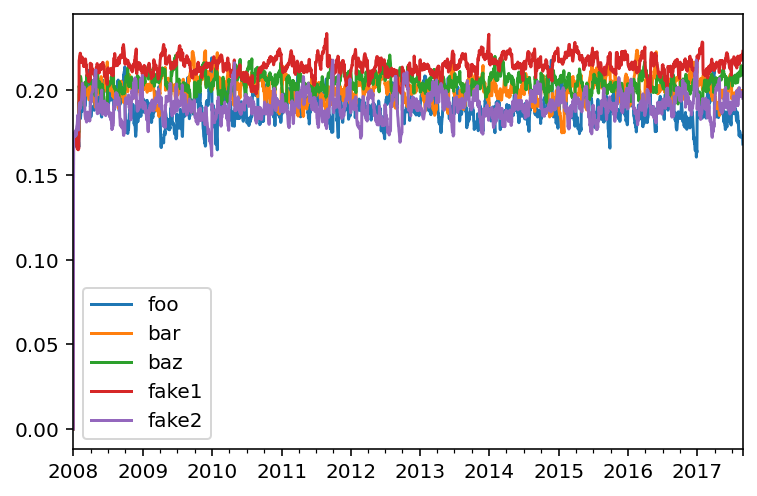
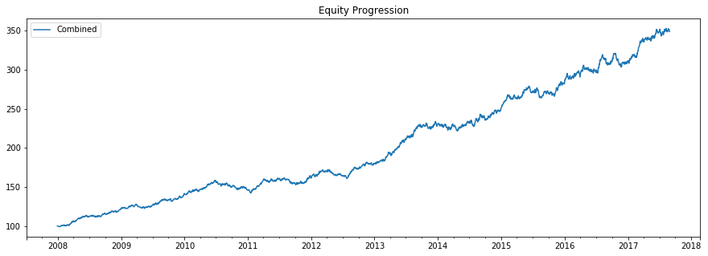

This notebook creates a parent strategy(combined) with 2 child
strategies(Equal Weight, Inv Vol).

Alternatively, it creates the 2 child strategies, runs the backtest,
combines the results, and creates a parent strategy using both of the
backtests.

.. code:: ipython3

    import numpy as np
    import pandas as pd
    import matplotlib.pyplot as plt
    
    import ffn
    import bt 
    
    %matplotlib inline

Create fake data
~~~~~~~~~~~~~~~~

.. code:: ipython3

    rf = 0.04
    np.random.seed(1)
    mus = np.random.normal(loc=0.05,scale=0.02,size=5) + rf
    sigmas = (mus - rf)/0.3 + np.random.normal(loc=0.,scale=0.01,size=5)
    
    num_years = 10
    num_months_per_year = 12
    num_days_per_month = 21
    num_days_per_year = num_months_per_year*num_days_per_month
    
    rdf = pd.DataFrame(
        index = pd.date_range(
            start="2008-01-02",
            periods=num_years*num_months_per_year*num_days_per_month,
            freq="B"
        ),
        columns=['foo','bar','baz','fake1','fake2']
    )
    
    for i,mu in enumerate(mus):
        sigma = sigmas[i]
        rdf.iloc[:,i] = np.random.normal(
            loc=mu/num_days_per_year,
            scale=sigma/np.sqrt(num_days_per_year),
            size=rdf.shape[0]
        )
    pdf = np.cumprod(1+rdf)*100
    pdf.iloc[0,:] = 100
    
    pdf.plot()

.. parsed-literal::
   :class: pynb-result

    <AxesSubplot:>

.. image:: _static/Strategy_Combination_3_1.png
   :class: pynb
   :width: 375px
   :height: 248px

.. code:: ipython3

    strategy_names = np.array(
        [
            'Equal Weight',
            'Inv Vol'
        ]
    )
    
    runMonthlyAlgo = bt.algos.RunMonthly(
        run_on_first_date=True,
        run_on_end_of_period=True
    )
    selectAllAlgo = bt.algos.SelectAll()
    rebalanceAlgo = bt.algos.Rebalance()
    
    strats = []
    tests = []
    
    for i,s in enumerate(strategy_names):
        if s == "Equal Weight":
            wAlgo = bt.algos.WeighEqually()
        elif s == "Inv Vol":
            wAlgo = bt.algos.WeighInvVol()
        
        strat = bt.Strategy(
            str(s),
            [
                runMonthlyAlgo,
                selectAllAlgo,
                wAlgo,
                rebalanceAlgo
            ]
        )
        strats.append(strat)
            
        t = bt.Backtest(
            strat,
            pdf,
            integer_positions = False,
            progress_bar=False
        )
        tests.append(t)

.. code:: ipython3

    combined_strategy = bt.Strategy(
        'Combined',
        algos = [
            runMonthlyAlgo,
            selectAllAlgo,
            bt.algos.WeighEqually(),
            rebalanceAlgo
        ],
        children = [x.strategy for x in tests]
    )
    
    combined_test = bt.Backtest(
        combined_strategy,
        pdf,
        integer_positions = False,
        progress_bar = False
    )
    
    res = bt.run(combined_test)

.. code:: ipython3

    res.prices.plot()

.. parsed-literal::
   :class: pynb-result

    <AxesSubplot:>

.. image:: _static/Strategy_Combination_6_1.png
   :class: pynb
   :width: 375px
   :height: 248px

.. code:: ipython3

    res.get_security_weights().plot()

.. parsed-literal::
   :class: pynb-result

    <AxesSubplot:>

In order to get the weights of each strategy, you can run each strategy,
get the prices for each strategy, combine them into one price dataframe,
run the combined strategy on the new data set.

.. code:: ipython3

    strategy_names = np.array(
        [
            'Equal Weight',
            'Inv Vol'
        ]
    )
    
    runMonthlyAlgo = bt.algos.RunMonthly(
        run_on_first_date=True,
        run_on_end_of_period=True
    )
    selectAllAlgo = bt.algos.SelectAll()
    rebalanceAlgo = bt.algos.Rebalance()
    
    strats = []
    tests = []
    results = []
    
    for i,s in enumerate(strategy_names):
        if s == "Equal Weight":
            wAlgo = bt.algos.WeighEqually()
        elif s == "Inv Vol":
            wAlgo = bt.algos.WeighInvVol()
        
        strat = bt.Strategy(
            s,
            [
                runMonthlyAlgo,
                selectAllAlgo,
                wAlgo,
                rebalanceAlgo
            ]
        )
        strats.append(strat)
            
        t = bt.Backtest(
            strat,
            pdf,
            integer_positions = False,
            progress_bar=False
        )
        tests.append(t)
        
        res = bt.run(t)
        results.append(res)

.. code:: ipython3

    fig, ax = plt.subplots(nrows=1,ncols=1)
    for i,r in enumerate(results):
        r.plot(ax=ax)

.. image:: _static/Strategy_Combination_10_0.png
   :class: pynb

.. code:: ipython3

    merged_prices_df = bt.merge(results[0].prices,results[1].prices)
    
    combined_strategy = bt.Strategy(
        'Combined',
        algos = [
            runMonthlyAlgo,
            selectAllAlgo,
            bt.algos.WeighEqually(),
            rebalanceAlgo
        ]
    )
    
    combined_test = bt.Backtest(
        combined_strategy,
        merged_prices_df,
        integer_positions = False,
        progress_bar = False
    )
    
    res = bt.run(combined_test)

.. parsed-literal::
   :class: pynb-result

    C:\ProgramData\Anaconda3\lib\site-packages\ffn\core.py:2054: RuntimeWarning: invalid value encountered in minimum
      negative_returns = np.minimum(returns, 0.)
    C:\ProgramData\Anaconda3\lib\site-packages\ffn\core.py:2056: RuntimeWarning: divide by zero encountered in true_divide
      res = np.divide(er.mean(), std)

.. code:: ipython3

    res.plot()

.. parsed-literal::
   :class: pynb-result

    <matplotlib.axes._subplots.AxesSubplot at 0x1d62f7d0748>

.. code:: ipython3

    res.get_security_weights().plot()

.. parsed-literal::
   :class: pynb-result

    <matplotlib.axes._subplots.AxesSubplot at 0x1d62f9fb0f0>

.. image:: _static/Strategy_Combination_13_1.png
   :class: pynb

