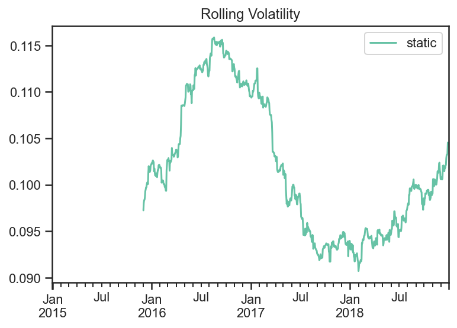
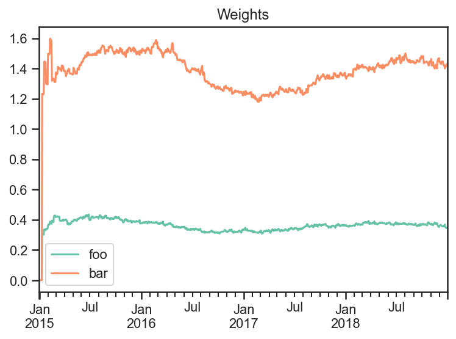
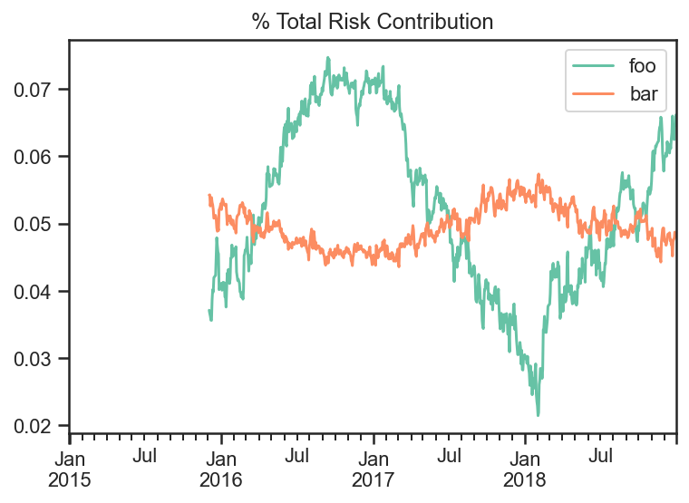

Target Volatility
-----------------

.. code:: ipython3

    import numpy as np
    import pandas as pd
    import matplotlib.pyplot as plt
    
    import ffn
    import bt
    
    %matplotlib inline

Create Fake Index Data
~~~~~~~~~~~~~~~~~~~~~~

.. code:: ipython3

    names = ['foo','bar','rf']
    dates = pd.date_range(start='2015-01-01',end='2018-12-31', freq=pd.tseries.offsets.BDay())
    n = len(dates)
    rdf = pd.DataFrame(
        np.zeros((n, len(names))),
        index = dates,
        columns = names
    )
    
    np.random.seed(1)
    rdf['foo'] = np.random.normal(loc = 0.1/252,scale=0.2/np.sqrt(252),size=n)
    rdf['bar'] = np.random.normal(loc = 0.04/252,scale=0.05/np.sqrt(252),size=n)
    rdf['rf'] = 0.
    
    pdf = 100*np.cumprod(1+rdf)
    pdf.plot();

.. image:: _static/Target_Volatility_3_0.png
   :class: pynb
   :width: 377px
   :height: 262px

Build Strategy
~~~~~~~~~~~~~~

.. code:: ipython3

    # algo to fire on the beginning of every week and to run on the first date
    runWeeklyAlgo = bt.algos.RunWeekly(
        run_on_first_date=True
    )
    
    selectTheseAlgo = bt.algos.SelectThese(['foo','bar'])
    
    # algo to set the weights to 1/vol contributions from each asset
    #  with data over the last 12 months excluding yesterday
    weighInvVolAlgo = bt.algos.WeighInvVol(
        lookback=pd.DateOffset(months=12),
        lag=pd.DateOffset(days=1)
    )
    
    # algo to set overall volatility of the portfolio to an annualized 10%
    targetVolAlgo = bt.algos.TargetVol(
        0.1,
        lookback=pd.DateOffset(months=12),
        lag=pd.DateOffset(days=1),
        covar_method='standard',
        annualization_factor=252
    )
    
    
    # algo to rebalance the current weights to weights set in target.temp
    rebalAlgo = bt.algos.Rebalance()
    
    # a strategy that rebalances monthly to specified weights
    strat = bt.Strategy('static',
        [
            runWeeklyAlgo,
            selectTheseAlgo,
            weighInvVolAlgo,
            targetVolAlgo,
            rebalAlgo
        ]
    )

Run Backtest
~~~~~~~~~~~~

Note: The logic of the strategy is seperate from the data used in the
backtest.

.. code:: ipython3

    # set integer_positions=False when positions are not required to be integers(round numbers)
    backtest = bt.Backtest(
        strat,
        pdf,
        integer_positions=False
    )
    
    res = bt.run(backtest)

You can see the realized volatility below is close to the targeted 10%
volatility.

.. code:: ipython3

    fig, ax = plt.subplots(nrows=1,ncols=1)
    (res.prices.pct_change().rolling(window=12*20).std()*np.sqrt(252)).plot(ax = ax)
    ax.set_title('Rolling Volatility')
    ax.plot();

Because we are using a 1/vol allocation bar, the less risky security,
has a much smaller weight.

.. code:: ipython3

    fig, ax = plt.subplots(nrows=1,ncols=1)
    res.get_security_weights().plot(ax = ax)
    ax.set_title('Weights')
    ax.plot();

If we plot the total risk contribution of each asset class and divide by
the total volatility, then we can see that both asset’s contribute
roughly similar amounts of volatility.

.. code:: ipython3

    weights = res.get_security_weights()
    rolling_cov = pdf.loc[:,weights.columns].pct_change().rolling(window=12*20).cov()*252
    
    
    trc = pd.DataFrame(
        np.nan,
        index = weights.index,
        columns = weights.columns
    )
    for dt in pdf.index:
        trc.loc[dt,:] = weights.loc[dt,:].values*rolling_cov.loc[dt,:].values@weights.loc[dt,:].values/np.sqrt(weights.loc[dt,:].values@rolling_cov.loc[dt,:].values@weights.loc[dt,:].values)
    
    
    fig, ax = plt.subplots(nrows=1,ncols=1)
    trc.plot(ax=ax)
    ax.set_title('% Total Risk Contribution')
    ax.plot();

