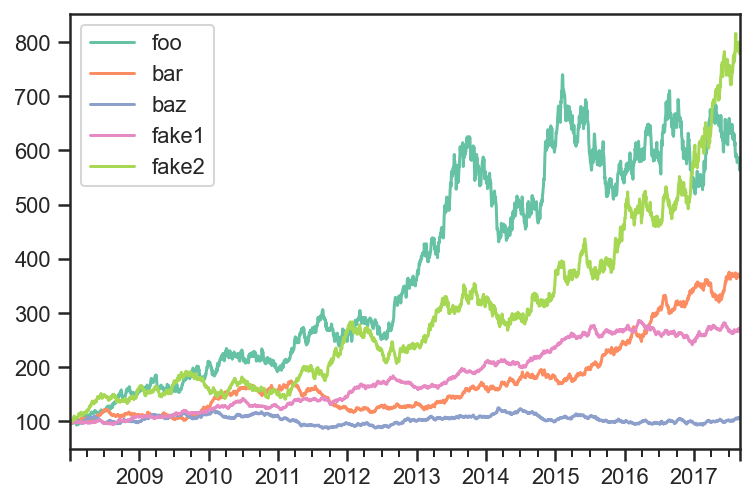
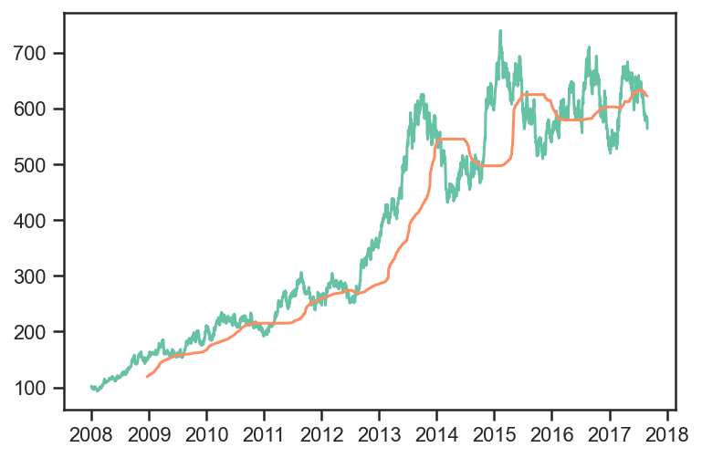

Trend Example 1
---------------

.. code:: ipython3

    import matplotlib.pyplot as plt
    import numpy as np
    import pandas as pd
    
    import ffn
    import bt
    
    %matplotlib inline

Create fake data
~~~~~~~~~~~~~~~~

.. code:: ipython3

    rf = 0.04
    np.random.seed(1)
    mus = np.random.normal(loc=0.05,scale=0.02,size=5) + rf
    sigmas = (mus - rf)/0.3 + np.random.normal(loc=0.,scale=0.01,size=5)
    
    num_years = 10
    num_months_per_year = 12
    num_days_per_month = 21
    num_days_per_year = num_months_per_year*num_days_per_month
    
    rdf = pd.DataFrame(
        index = pd.date_range(
            start="2008-01-02",
            periods=num_years*num_months_per_year*num_days_per_month,
            freq="B"
        ),
        columns=['foo','bar','baz','fake1','fake2']
    )
    
    for i,mu in enumerate(mus):
        sigma = sigmas[i]
        rdf.iloc[:,i] = np.random.normal(
            loc=mu/num_days_per_year,
            scale=sigma/np.sqrt(num_days_per_year),
            size=rdf.shape[0]
        )
    pdf = np.cumprod(1+rdf)*100
    
    pdf.plot();

Create Trend signal over the last 12 months
~~~~~~~~~~~~~~~~~~~~~~~~~~~~~~~~~~~~~~~~~~~

.. code:: ipython3

    sma  = pdf.rolling(window=num_days_per_month*12,center=False).median().shift(1)
    plt.plot(pdf.index,pdf['foo'])
    plt.plot(sma.index,sma['foo'])
    plt.show()

.. code:: ipython3

    #sma with 1 day lag
    sma.tail()

.. raw:: html

    

    
    <table border="1" class="dataframe">
      <thead>
        <tr style="text-align: right;">
          <th></th>
          <th>foo</th>
          <th>bar</th>
          <th>baz</th>
          <th>fake1</th>
          <th>fake2</th>
        </tr>
      </thead>
      <tbody>
        <tr>
          <th>2017-08-23</th>
          <td>623.241267</td>
          <td>340.774506</td>
          <td>99.764885</td>
          <td>263.491447</td>
          <td>619.963986</td>
        </tr>
        <tr>
          <th>2017-08-24</th>
          <td>623.167989</td>
          <td>341.096742</td>
          <td>99.764885</td>
          <td>263.502145</td>
          <td>620.979948</td>
        </tr>
        <tr>
          <th>2017-08-25</th>
          <td>622.749149</td>
          <td>341.316672</td>
          <td>99.764885</td>
          <td>263.502145</td>
          <td>622.421401</td>
        </tr>
        <tr>
          <th>2017-08-28</th>
          <td>622.353039</td>
          <td>341.494307</td>
          <td>99.807732</td>
          <td>263.517071</td>
          <td>622.962579</td>
        </tr>
        <tr>
          <th>2017-08-29</th>
          <td>622.153294</td>
          <td>341.662442</td>
          <td>99.807732</td>
          <td>263.517071</td>
          <td>622.992416</td>
        </tr>
      </tbody>
    </table>
    

.. code:: ipython3

    #sma with 0 day lag
    pdf.rolling(window=num_days_per_month*12,center=False).median().tail()

.. raw:: html

    

    
    <table border="1" class="dataframe">
      <thead>
        <tr style="text-align: right;">
          <th></th>
          <th>foo</th>
          <th>bar</th>
          <th>baz</th>
          <th>fake1</th>
          <th>fake2</th>
        </tr>
      </thead>
      <tbody>
        <tr>
          <th>2017-08-23</th>
          <td>623.167989</td>
          <td>341.096742</td>
          <td>99.764885</td>
          <td>263.502145</td>
          <td>620.979948</td>
        </tr>
        <tr>
          <th>2017-08-24</th>
          <td>622.749149</td>
          <td>341.316672</td>
          <td>99.764885</td>
          <td>263.502145</td>
          <td>622.421401</td>
        </tr>
        <tr>
          <th>2017-08-25</th>
          <td>622.353039</td>
          <td>341.494307</td>
          <td>99.807732</td>
          <td>263.517071</td>
          <td>622.962579</td>
        </tr>
        <tr>
          <th>2017-08-28</th>
          <td>622.153294</td>
          <td>341.662442</td>
          <td>99.807732</td>
          <td>263.517071</td>
          <td>622.992416</td>
        </tr>
        <tr>
          <th>2017-08-29</th>
          <td>621.907867</td>
          <td>341.948212</td>
          <td>99.807732</td>
          <td>263.634283</td>
          <td>624.310473</td>
        </tr>
      </tbody>
    </table>
    

.. code:: ipython3

    # target weights
    trend = sma.copy()
    trend[pdf > sma] = True
    trend[pdf <= sma] = False
    trend[sma.isnull()] = False
    trend.tail()

.. raw:: html

    

    
    <table border="1" class="dataframe">
      <thead>
        <tr style="text-align: right;">
          <th></th>
          <th>foo</th>
          <th>bar</th>
          <th>baz</th>
          <th>fake1</th>
          <th>fake2</th>
        </tr>
      </thead>
      <tbody>
        <tr>
          <th>2017-08-23</th>
          <td>False</td>
          <td>True</td>
          <td>True</td>
          <td>True</td>
          <td>True</td>
        </tr>
        <tr>
          <th>2017-08-24</th>
          <td>False</td>
          <td>True</td>
          <td>True</td>
          <td>True</td>
          <td>True</td>
        </tr>
        <tr>
          <th>2017-08-25</th>
          <td>False</td>
          <td>True</td>
          <td>True</td>
          <td>True</td>
          <td>True</td>
        </tr>
        <tr>
          <th>2017-08-28</th>
          <td>False</td>
          <td>True</td>
          <td>True</td>
          <td>True</td>
          <td>True</td>
        </tr>
        <tr>
          <th>2017-08-29</th>
          <td>False</td>
          <td>True</td>
          <td>True</td>
          <td>True</td>
          <td>True</td>
        </tr>
      </tbody>
    </table>
    

Compare EW and 1/vol

Both strategies rebalance daily using trend with 1 day lag and weights
limited to 40%.

.. code:: ipython3

    
    
    tsmom_invvol_strat = bt.Strategy(
        'tsmom_invvol',
        [
            bt.algos.RunDaily(),
            bt.algos.SelectWhere(trend),
            bt.algos.WeighInvVol(),
            bt.algos.LimitWeights(limit=0.4),
            bt.algos.Rebalance()
        ]
    )
    
    tsmom_ew_strat = bt.Strategy(
        'tsmom_ew',
        [
            bt.algos.RunDaily(),
            bt.algos.SelectWhere(trend),
            bt.algos.WeighEqually(),
            bt.algos.LimitWeights(limit=0.4),
            bt.algos.Rebalance()
        ]
    )

.. code:: ipython3

    # create and run
    tsmom_invvol_bt = bt.Backtest(
        tsmom_invvol_strat,
        pdf,
        initial_capital=50000000.0,
        commissions=lambda q, p: max(100, abs(q) * 0.0021),
        integer_positions=False,
        progress_bar=True
    )
    tsmom_invvol_res = bt.run(tsmom_invvol_bt)
    
    tsmom_ew_bt = bt.Backtest(
        tsmom_ew_strat,
        pdf,
        
        initial_capital=50000000.0,
        commissions=lambda q, p: max(100, abs(q) * 0.0021),
        integer_positions=False,
        progress_bar=True
    )
    tsmom_ew_res = bt.run(tsmom_ew_bt)

.. parsed-literal::
   :class: pynb-result

    tsmom_invvol
    0% [############################# ] 100% | ETA: 00:00:00tsmom_ew
    0% [############################# ] 100% | ETA: 00:00:00

.. code:: ipython3

    ax = plt.subplot()
    ax.plot(tsmom_ew_res.prices.index,tsmom_ew_res.prices,label='EW')
    pdf.plot(ax=ax)
    
    ax.legend()
    plt.legend()
    plt.show()

.. image:: _static/Trend_1_12_0.png
   :class: pynb
   :width: 376px
   :height: 240px

.. code:: ipython3

    tsmom_ew_res.stats

.. raw:: html

    

    
    <table border="1" class="dataframe">
      <thead>
        <tr style="text-align: right;">
          <th></th>
          <th>tsmom_ew</th>
        </tr>
      </thead>
      <tbody>
        <tr>
          <th>start</th>
          <td>2008-01-01 00:00:00</td>
        </tr>
        <tr>
          <th>end</th>
          <td>2017-08-29 00:00:00</td>
        </tr>
        <tr>
          <th>rf</th>
          <td>0.0</td>
        </tr>
        <tr>
          <th>total_return</th>
          <td>1.982933</td>
        </tr>
        <tr>
          <th>cagr</th>
          <td>0.119797</td>
        </tr>
        <tr>
          <th>max_drawdown</th>
          <td>-0.103421</td>
        </tr>
        <tr>
          <th>calmar</th>
          <td>1.158343</td>
        </tr>
        <tr>
          <th>mtd</th>
          <td>0.017544</td>
        </tr>
        <tr>
          <th>three_month</th>
          <td>0.040722</td>
        </tr>
        <tr>
          <th>six_month</th>
          <td>0.079362</td>
        </tr>
        <tr>
          <th>ytd</th>
          <td>0.08107</td>
        </tr>
        <tr>
          <th>one_year</th>
          <td>0.100432</td>
        </tr>
        <tr>
          <th>three_year</th>
          <td>0.159895</td>
        </tr>
        <tr>
          <th>five_year</th>
          <td>0.172284</td>
        </tr>
        <tr>
          <th>ten_year</th>
          <td>0.119797</td>
        </tr>
        <tr>
          <th>incep</th>
          <td>0.119797</td>
        </tr>
        <tr>
          <th>daily_sharpe</th>
          <td>1.356727</td>
        </tr>
        <tr>
          <th>daily_sortino</th>
          <td>2.332895</td>
        </tr>
        <tr>
          <th>daily_mean</th>
          <td>0.112765</td>
        </tr>
        <tr>
          <th>daily_vol</th>
          <td>0.083116</td>
        </tr>
        <tr>
          <th>daily_skew</th>
          <td>0.029851</td>
        </tr>
        <tr>
          <th>daily_kurt</th>
          <td>0.96973</td>
        </tr>
        <tr>
          <th>best_day</th>
          <td>0.02107</td>
        </tr>
        <tr>
          <th>worst_day</th>
          <td>-0.021109</td>
        </tr>
        <tr>
          <th>monthly_sharpe</th>
          <td>1.373241</td>
        </tr>
        <tr>
          <th>monthly_sortino</th>
          <td>2.966223</td>
        </tr>
        <tr>
          <th>monthly_mean</th>
          <td>0.118231</td>
        </tr>
        <tr>
          <th>monthly_vol</th>
          <td>0.086096</td>
        </tr>
        <tr>
          <th>monthly_skew</th>
          <td>-0.059867</td>
        </tr>
        <tr>
          <th>monthly_kurt</th>
          <td>0.571064</td>
        </tr>
        <tr>
          <th>best_month</th>
          <td>0.070108</td>
        </tr>
        <tr>
          <th>worst_month</th>
          <td>-0.064743</td>
        </tr>
        <tr>
          <th>yearly_sharpe</th>
          <td>1.741129</td>
        </tr>
        <tr>
          <th>yearly_sortino</th>
          <td>inf</td>
        </tr>
        <tr>
          <th>yearly_mean</th>
          <td>0.129033</td>
        </tr>
        <tr>
          <th>yearly_vol</th>
          <td>0.074109</td>
        </tr>
        <tr>
          <th>yearly_skew</th>
          <td>0.990397</td>
        </tr>
        <tr>
          <th>yearly_kurt</th>
          <td>1.973883</td>
        </tr>
        <tr>
          <th>best_year</th>
          <td>0.285249</td>
        </tr>
        <tr>
          <th>worst_year</th>
          <td>0.024152</td>
        </tr>
        <tr>
          <th>avg_drawdown</th>
          <td>-0.015516</td>
        </tr>
        <tr>
          <th>avg_drawdown_days</th>
          <td>25.223214</td>
        </tr>
        <tr>
          <th>avg_up_month</th>
          <td>0.024988</td>
        </tr>
        <tr>
          <th>avg_down_month</th>
          <td>-0.012046</td>
        </tr>
        <tr>
          <th>win_year_perc</th>
          <td>1.0</td>
        </tr>
        <tr>
          <th>twelve_month_win_perc</th>
          <td>0.971429</td>
        </tr>
      </tbody>
    </table>
    

