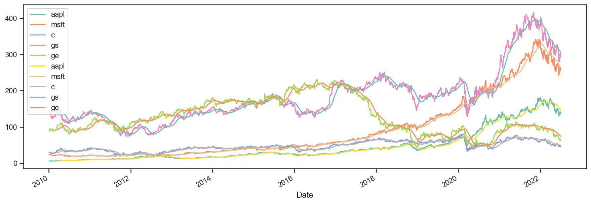
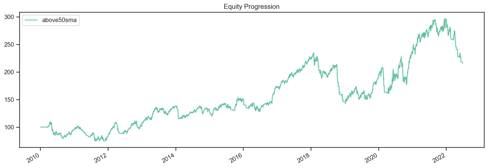
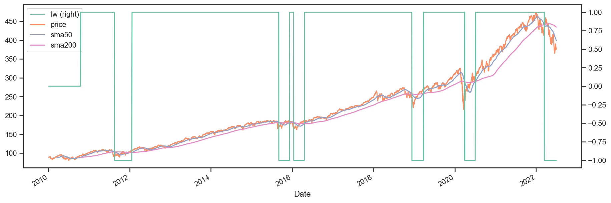
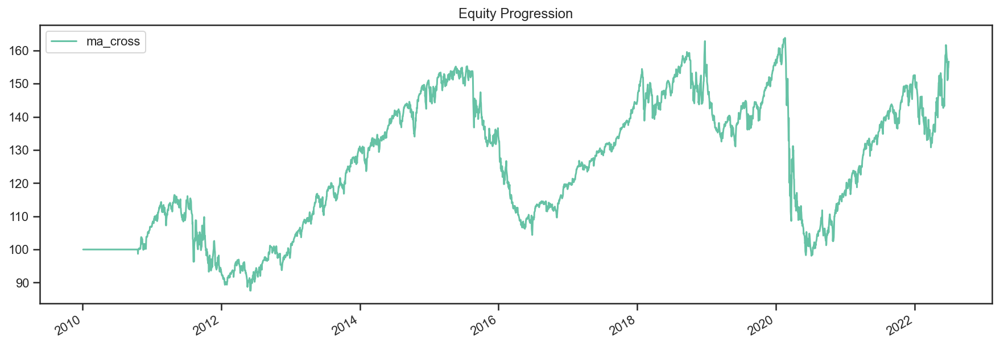
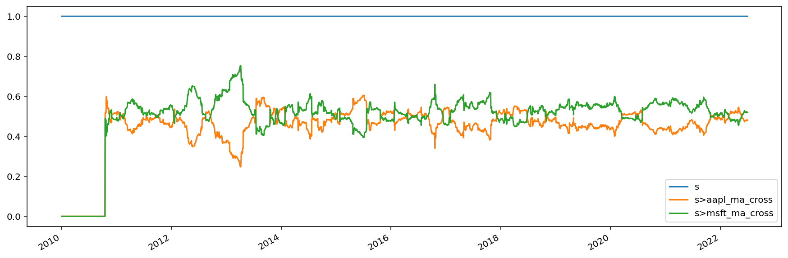
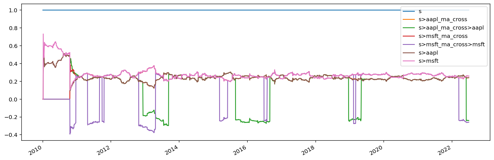
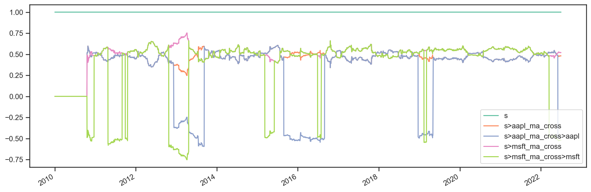

SMA Strategy
------------

Let’s start off with a Simple Moving Average (SMA) strategy. We will
start with a simple version of the strategy, namely:

-  **Select** the securities that are currently above their 50 day
   moving average
-  **Weigh** each selected security equally
-  **Rebalance** the portfolio to reflect the target weights

This should be pretty simple to build. The only thing missing above is
the calculation of the simple moving average. When should this take
place?

Given the flexibility of **bt**, there is no strict rule. The average
calculation could be performed in an Algo, but that would be pretty
inefficient. A better way would be to calculate the moving average at
the beginning - before starting the backtest. After all, all the data is
known in advance.

Now that we know what we have to do, let’s get started. First we will
download some data and calculate the simple moving average.

.. code:: ipython3

    import bt

.. code:: ipython3

    %matplotlib inline

.. code:: ipython3

    # download data
    data = bt.get('aapl,msft,c,gs,ge', start='2010-01-01')
    
    # calculate moving average DataFrame using pandas' rolling_mean
    import pandas as pd
    # a rolling mean is a moving average, right?
    sma = data.rolling(50).mean()

It’s always a good idea to plot your data to make sure it looks ok. So
let’s see how the data + sma plot looks like.

.. code:: ipython3

    # let's see what the data looks like - this is by no means a pretty chart, but it does the job
    plot = bt.merge(data, sma).plot(figsize=(15, 5))

Looks legit.

Now that we have our data, we will need to create our security selection
logic. Let’s create a basic Algo that will select the securities that
are above their moving average.

Before we do that, let’s think about how we will code it. We could pass
the SMA data and then extract the row (from the sma DataFrame) on the
current date, compare the values to the current prices, and then keep a
list of those securities where the price is above the SMA. This is the
most straightforward approach. However, this is not very re-usable
because the logic within the Algo will be quite specific to the task at
hand and if we wish to change the logic, we will have to write a new
algo.

For example, what if we wanted to select securities that were below
their sma? Or what if we only wanted securities that were 5% above their
sma?

What we could do instead is pre-calculate the selection logic DataFrame
(a fast, vectorized operation) and write a generic Algo that takes in
this boolean DataFrame and returns the securities where the value is
True on a given date. This will be must faster and much more reusable.
Let’s see how the implementation looks like.

.. code:: ipython3

    class SelectWhere(bt.Algo):
        
        """
        Selects securities based on an indicator DataFrame.
        
        Selects securities where the value is True on the current date (target.now).
        
        Args:
            * signal (DataFrame): DataFrame containing the signal (boolean DataFrame)
        
        Sets:
            * selected
        
        """
        def __init__(self, signal):
            self.signal = signal
            
        def __call__(self, target):
            # get signal on target.now
            if target.now in self.signal.index:
                sig = self.signal.loc[target.now]
    
                # get indices where true as list
                selected = list(sig.index[sig])
    
                # save in temp - this will be used by the weighing algo
                target.temp['selected'] = selected
            
            # return True because we want to keep on moving down the stack
            return True

So there we have it. Our selection Algo. 

.. note:: 

    By the way, this Algo already exists - I just wanted to show you how you would code it from scratch. 
    :class:`Here is the code <bt.algos.SelectWhere>`.

All we have to do now is pass in a signal matrix. In our case, it's quite easy::

    signal = data > sma

Simple, concise and more importantly, fast! Let's move on and test the strategy. 

.. code:: ipython3

    # first we create the Strategy
    s = bt.Strategy('above50sma', [SelectWhere(data > sma),
                                   bt.algos.WeighEqually(),
                                   bt.algos.Rebalance()])
    
    # now we create the Backtest
    t = bt.Backtest(s, data)
    
    # and let's run it!
    res = bt.run(t)

So just to recap, we created the strategy, created the backtest by joining Strategy+Data, and ran the backtest. Let's see the results.

.. code:: ipython3

    # what does the equity curve look like?
    res.plot();

.. code:: ipython3

    # and some performance stats
    res.display()

.. parsed-literal::
   :class: pynb-result

    Stat                 above50sma
    -------------------  ------------
    Start                2010-01-03
    End                  2022-07-01
    Risk-free rate       0.00%
    
    Total Return         116.08%
    Daily Sharpe         0.42
    Daily Sortino        0.63
    CAGR                 6.36%
    Max Drawdown         -39.43%
    Calmar Ratio         0.16
    
    MTD                  0.00%
    3m                   -19.50%
    6m                   -26.03%
    YTD                  -26.03%
    1Y                   -22.10%
    3Y (ann.)            10.34%
    5Y (ann.)            1.89%
    10Y (ann.)           8.70%
    Since Incep. (ann.)  6.36%
    
    Daily Sharpe         0.42
    Daily Sortino        0.63
    Daily Mean (ann.)    8.07%
    Daily Vol (ann.)     19.45%
    Daily Skew           -0.65
    Daily Kurt           4.74
    Best Day             5.78%
    Worst Day            -8.26%
    
    Monthly Sharpe       0.39
    Monthly Sortino      0.65
    Monthly Mean (ann.)  8.59%
    Monthly Vol (ann.)   21.86%
    Monthly Skew         -0.37
    Monthly Kurt         0.73
    Best Month           21.65%
    Worst Month          -17.26%
    
    Yearly Sharpe        0.41
    Yearly Sortino       0.83
    Yearly Mean          9.78%
    Yearly Vol           23.65%
    Yearly Skew          -0.88
    Yearly Kurt          -0.67
    Best Year            34.85%
    Worst Year           -34.38%
    
    Avg. Drawdown        -3.56%
    Avg. Drawdown Days   47.27
    Avg. Up Month        4.76%
    Avg. Down Month      -5.35%
    Win Year %           66.67%
    Win 12m %            67.14%

Nothing stellar but at least you learnt something along the way (I
hope).

Oh, and one more thing. If you were to write your own “library” of
backtests, you might want to write yourself a helper function that would
allow you to test different parameters and securities. That function
might look something like this:

.. code:: ipython3

    def above_sma(tickers, sma_per=50, start='2010-01-01', name='above_sma'):
        """
        Long securities that are above their n period 
        Simple Moving Averages with equal weights.
        """
        # download data
        data = bt.get(tickers, start=start)
        # calc sma
        sma = data.rolling(sma_per).mean()
    
        # create strategy
        s = bt.Strategy(name, [SelectWhere(data > sma),
                               bt.algos.WeighEqually(),
                               bt.algos.Rebalance()])    
    
        # now we create the backtest
        return bt.Backtest(s, data)

This function allows us to easily generate backtests. We could easily
compare a few different SMA periods. Also, let’s see if we can beat a
long-only allocation to the SPY.

.. code:: ipython3

    # simple backtest to test long-only allocation
    def long_only_ew(tickers, start='2010-01-01', name='long_only_ew'):
        s = bt.Strategy(name, [bt.algos.RunOnce(),
                               bt.algos.SelectAll(),
                               bt.algos.WeighEqually(),
                               bt.algos.Rebalance()])
        data = bt.get(tickers, start=start)
        return bt.Backtest(s, data)
    
    # create the backtests
    tickers = 'aapl,msft,c,gs,ge'
    sma10 = above_sma(tickers, sma_per=10, name='sma10')
    sma20 = above_sma(tickers, sma_per=20, name='sma20')
    sma40 = above_sma(tickers, sma_per=40, name='sma40')
    benchmark = long_only_ew('spy', name='spy')
    
    # run all the backtests!
    res2 = bt.run(sma10, sma20, sma40, benchmark)

.. code:: ipython3

    res2.plot(freq='m');

.. image:: _static/examples-nb_18_0.png
   :class: pynb
   :width: 879px
   :height: 320px

.. code:: ipython3

    res2.display()

.. parsed-literal::
   :class: pynb-result

    Stat                 sma10       sma20       sma40       spy
    -------------------  ----------  ----------  ----------  ----------
    Start                2010-01-03  2010-01-03  2010-01-03  2010-01-03
    End                  2022-07-01  2022-07-01  2022-07-01  2022-07-01
    Risk-free rate       0.00%       0.00%       0.00%       0.00%
    
    Total Return         284.16%     229.80%     145.62%     321.22%
    Daily Sharpe         0.63        0.58        0.47        0.75
    Daily Sortino        0.99        0.91        0.73        1.15
    CAGR                 11.38%      10.03%      7.46%       12.20%
    Max Drawdown         -31.77%     -40.72%     -34.93%     -33.72%
    Calmar Ratio         0.36        0.25        0.21        0.36
    
    MTD                  -0.76%      0.00%       0.00%       -0.37%
    3m                   -10.58%     -22.25%     -18.82%     -16.66%
    6m                   -10.71%     -32.14%     -30.31%     -20.28%
    YTD                  -10.71%     -32.14%     -30.31%     -20.28%
    1Y                   -13.63%     -24.65%     -27.20%     -11.44%
    3Y (ann.)            28.10%      14.77%      3.73%       10.10%
    5Y (ann.)            15.80%      8.37%       1.96%       11.11%
    10Y (ann.)           13.76%      10.96%      9.67%       12.78%
    Since Incep. (ann.)  11.38%      10.03%      7.46%       12.20%
    
    Daily Sharpe         0.63        0.58        0.47        0.75
    Daily Sortino        0.99        0.91        0.73        1.15
    Daily Mean (ann.)    12.88%      11.52%      9.01%       13.03%
    Daily Vol (ann.)     20.48%      19.79%      18.97%      17.34%
    Daily Skew           -0.11       -0.29       -0.45       -0.59
    Daily Kurt           6.61        6.23        4.32        11.75
    Best Day             10.47%      10.47%      6.20%       9.06%
    Worst Day            -8.26%      -8.26%      -8.26%      -10.94%
    
    Monthly Sharpe       0.65        0.54        0.43        0.92
    Monthly Sortino      1.18        1.02        0.75        1.62
    Monthly Mean (ann.)  13.56%      11.95%      9.71%       13.00%
    Monthly Vol (ann.)   20.96%      21.94%      22.42%      14.20%
    Monthly Skew         -0.02       0.22        -0.10       -0.40
    Monthly Kurt         1.01        1.11        0.67        0.89
    Best Month           22.75%      24.73%      21.97%      12.70%
    Worst Month          -16.94%     -14.34%     -15.86%     -12.49%
    
    Yearly Sharpe        0.54        0.43        0.40        0.80
    Yearly Sortino       2.01        1.03        0.77        2.15
    Yearly Mean          13.38%      13.94%      9.76%       12.67%
    Yearly Vol           24.64%      32.80%      24.22%      15.79%
    Yearly Skew          0.41        -0.15       -0.87       -0.68
    Yearly Kurt          -0.43       -0.96       -0.59       0.12
    Best Year            62.47%      66.99%      39.35%      32.31%
    Worst Year           -18.59%     -37.01%     -32.06%     -20.28%
    
    Avg. Drawdown        -3.95%      -3.49%      -3.68%      -1.69%
    Avg. Drawdown Days   40.43       35.12       48.79       15.92
    Avg. Up Month        4.68%       5.00%       4.69%       3.20%
    Avg. Down Month      -5.00%      -4.85%      -5.70%      -3.56%
    Win Year %           58.33%      66.67%      75.00%      83.33%
    Win 12m %            68.57%      66.43%      69.29%      91.43%

And there you have it. Beating the market ain’t that easy!

SMA Crossover Strategy
----------------------

Let’s build on the last section to test a moving average crossover
strategy. The easiest way to achieve this is to build an Algo similar to
SelectWhere, but for the purpose of setting target weights. Let’s call
this algo WeighTarget. This algo will take a DataFrame of target weights
that we will pre-calculate.

Basically, when the 50 day moving average will be above the 200-day
moving average, we will be long (+1 target weight). Conversely, when the
50 is below the 200, we will be short (-1 target weight).

Here’s the WeighTarget implementation (this Algo also already exists in
the algos module):

.. code:: ipython3

    class WeighTarget(bt.Algo):
        """
        Sets target weights based on a target weight DataFrame.
        
        Args:
            * target_weights (DataFrame): DataFrame containing the target weights
        
        Sets:
            * weights
        
        """
        
        def __init__(self, target_weights):
            self.tw = target_weights
        
        def __call__(self, target):
            # get target weights on date target.now
            if target.now in self.tw.index:
                w = self.tw.loc[target.now]                
    
                # save in temp - this will be used by the weighing algo
                # also dropping any na's just in case they pop up
                target.temp['weights'] = w.dropna()
            
            # return True because we want to keep on moving down the stack
            return True

So let’s start with a simple 50-200 day sma crossover for a single
security.

.. code:: ipython3

    ## download some data & calc SMAs
    data = bt.get('spy', start='2010-01-01')
    sma50 = data.rolling(50).mean()
    sma200 = data.rolling(200).mean()
    
    ## now we need to calculate our target weight DataFrame
    # first we will copy the sma200 DataFrame since our weights will have the same strucutre
    tw = sma200.copy()
    # set appropriate target weights
    tw[sma50 > sma200] = 1.0
    tw[sma50 <= sma200] = -1.0
    # here we will set the weight to 0 - this is because the sma200 needs 200 data points before
    # calculating its first point. Therefore, it will start with a bunch of nulls (NaNs).
    tw[sma200.isnull()] = 0.0

Ok so we downloaded our data, calculated the simple moving averages, and
then we setup our target weight (tw) DataFrame. Let’s take a look at our
target weights to see if they make any sense.

.. code:: ipython3

    # plot the target weights + chart of price & SMAs
    tmp = bt.merge(tw, data, sma50, sma200)
    tmp.columns = ['tw', 'price', 'sma50', 'sma200']
    ax = tmp.plot(figsize=(15,5), secondary_y=['tw'])

As mentioned earlier, it’s always a good idea to plot your strategy
data. It is usually easier to spot logic/programming errors this way,
especially when dealing with lots of data.

Now let’s move on with the Strategy & Backtest.

.. code:: ipython3

    ma_cross = bt.Strategy('ma_cross', [WeighTarget(tw),
                                        bt.algos.Rebalance()])
    
    t = bt.Backtest(ma_cross, data)
    res = bt.run(t)

.. code:: ipython3

    res.plot();

Ok great so there we have our basic moving average crossover strategy.

Exploring the Tree Structure
----------------------------

So far, we have explored strategies that allocate capital to securities.
But what if we wanted to test a strategy that allocated capital to
sub-strategies?

The most straightforward way would be to test the different
sub-strategies, extract their equity curves and create “synthetic
securities” that would basically just represent the returns achieved
from allocating capital to the different sub-strategies.

Let’s see how this looks:

.. code:: ipython3

    # first let's create a helper function to create a ma cross backtest
    def ma_cross(ticker, start='2010-01-01', 
                 short_ma=50, long_ma=200, name='ma_cross'):
        # these are all the same steps as above
        data = bt.get(ticker, start=start)
        short_sma = data.rolling(short_ma).mean()
        long_sma  = data.rolling(long_ma).mean()
    
        # target weights
        tw = long_sma.copy()
        tw[short_sma > long_sma] = 1.0
        tw[short_sma <= long_sma] = -1.0    
        tw[long_sma.isnull()] = 0.0
        
        # here we specify the children (3rd) arguemnt to make sure the strategy
        # has the proper universe. This is necessary in strategies of strategies
        s = bt.Strategy(name, [WeighTarget(tw), bt.algos.Rebalance()], [ticker])
    
        return bt.Backtest(s, data)
    
    # ok now let's create a few backtests and gather the results.
    # these will later become our "synthetic securities"
    t1 = ma_cross('aapl', name='aapl_ma_cross')
    t2 = ma_cross('msft', name='msft_ma_cross')
    
    # let's run these strategies now
    res = bt.run(t1, t2)
    
    # now that we have run the strategies, let's extract
    # the data to create "synthetic securities"
    data = bt.merge(res['aapl_ma_cross'].prices, res['msft_ma_cross'].prices)
    
    # now we have our new data. This data is basically the equity
    # curves of both backtested strategies. Now we can just use this
    # to test any old strategy, just like before.
    s = bt.Strategy('s', [bt.algos.SelectAll(),
                          bt.algos.WeighInvVol(),
                          bt.algos.Rebalance()])
    
    # create and run
    t = bt.Backtest(s, data)
    res = bt.run(t)

.. code:: ipython3

    res.plot();

.. code:: ipython3

    res.plot_weights();

.. image:: _static/examples-nb_33_0.png
   :class: pynb
   :width: 876px
   :height: 289px

As we can see above, the process is a bit more involved, but it works.
It is not very elegant though, and obtaining security-level allocation
information is problematic.

Luckily, bt has built-in functionality for dealing with strategies of
strategies. It uses the same general principal as demonstrated above but
does it seamlessly. Basically, when a strategy is a child of another
strategy, it will create a “paper trade” version of itself internally.
As we run our strategy, it will run its internal “paper version” and use
the returns from that strategy to populate the **price** property.

This means that the parent strategy can use the price information (which
reflects the returns of the strategy had it been employed) to determine
the appropriate allocation. Again, this is basically the same process as
above, just packed into 1 step.

Perhaps some code will help:

.. code:: ipython3

    # once again, we will create a few backtests
    # these will be the child strategies
    t1 = ma_cross('aapl', name='aapl_ma_cross')
    t2 = ma_cross('msft', name='msft_ma_cross')
    
    # let's extract the data object
    data = bt.merge(t1.data, t2.data)
    
    # now we create the parent strategy
    # we specify the children to be the two 
    # strategies created above
    s = bt.Strategy('s', [bt.algos.SelectAll(),
                          bt.algos.WeighInvVol(),
                          bt.algos.Rebalance()],
                    [t1.strategy, t2.strategy])
    
    # create and run
    t = bt.Backtest(s, data)
    res = bt.run(t)

.. code:: ipython3

    res.plot();

.. code:: ipython3

    res.plot_weights();

So there you have it. Simpler, and more complete.
