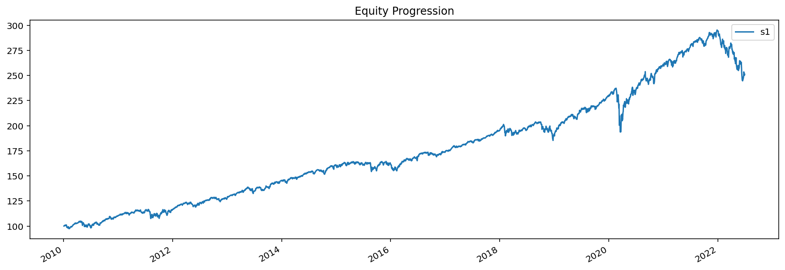
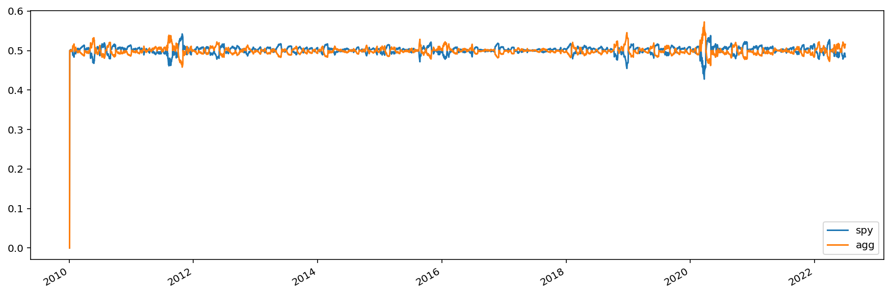
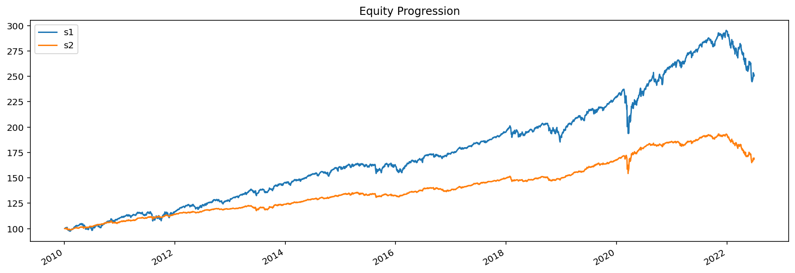

.. code:: ipython3

    import bt

.. code:: ipython3

    %matplotlib inline

A Simple Strategy Backtest
~~~~~~~~~~~~~~~~~~~~~~~~~~

Let's create a simple strategy. We will create a monthly rebalanced, long-only strategy where we place equal weights on each asset in our universe of assets.

First, we will download some data. By default, :func:`bt.get (alias for ffn.get) <ffn.data.get>` downloads the Adjusted Close from Yahoo! Finance. We will download some data starting on January 1, 2010 for the purposes of this demo.

.. code:: ipython3

    # fetch some data
    data = bt.get('spy,agg', start='2010-01-01')
    print(data.head())

.. parsed-literal::
   :class: pynb-result

                      spy        agg
    Date                            
    2010-01-04  89.225410  74.942825
    2010-01-05  89.461586  75.283791
    2010-01-06  89.524574  75.240227
    2010-01-07  89.902473  75.153221
    2010-01-08  90.201691  75.196724

Once we have our data, we will create our strategy. The :class:`Strategy <bt.core.Strategy>` object contains the strategy logic by combining various :class:`Algos <bt.core.Algo>`. 

.. code:: ipython3

    # create the strategy
    s = bt.Strategy('s1', [bt.algos.RunMonthly(),
                           bt.algos.SelectAll(),
                           bt.algos.WeighEqually(),
                           bt.algos.Rebalance()])

Finally, we will create a :class:`Backtest <bt.backtest.Backtest>`, which is the logical combination of a strategy with a data set.

Once this is done, we can run the backtest and analyze the results.

.. code:: ipython3

    # create a backtest and run it
    test = bt.Backtest(s, data)
    res = bt.run(test)

Now we can analyze the results of our backtest. The :class:`Result <bt.backtest.Result>` object is a thin wrapper around `ffn.GroupStats <http://pmorissette.github.io/ffn/ffn.html#ffn.core.GroupStats>`__ that adds some helper methods.

.. code:: ipython3

    # first let's see an equity curve
    res.plot();

.. code:: ipython3

    # ok and what about some stats?
    res.display()

.. parsed-literal::
   :class: pynb-result

    Stat                 s1
    -------------------  ----------
    Start                2010-01-03
    End                  2022-07-01
    Risk-free rate       0.00%
    
    Total Return         150.73%
    Daily Sharpe         0.90
    Daily Sortino        1.35
    CAGR                 7.64%
    Max Drawdown         -18.42%
    Calmar Ratio         0.41
    
    MTD                  0.18%
    3m                   -10.33%
    6m                   -14.84%
    YTD                  -14.84%
    1Y                   -10.15%
    3Y (ann.)            5.12%
    5Y (ann.)            6.44%
    10Y (ann.)           7.36%
    Since Incep. (ann.)  7.64%
    
    Daily Sharpe         0.90
    Daily Sortino        1.35
    Daily Mean (ann.)    7.74%
    Daily Vol (ann.)     8.62%
    Daily Skew           -0.98
    Daily Kurt           16.56
    Best Day             4.77%
    Worst Day            -6.63%
    
    Monthly Sharpe       1.06
    Monthly Sortino      1.91
    Monthly Mean (ann.)  7.81%
    Monthly Vol (ann.)   7.36%
    Monthly Skew         -0.39
    Monthly Kurt         1.59
    Best Month           7.57%
    Worst Month          -6.44%
    
    Yearly Sharpe        0.81
    Yearly Sortino       1.75
    Yearly Mean          7.48%
    Yearly Vol           9.17%
    Yearly Skew          -1.34
    Yearly Kurt          2.28
    Best Year            19.64%
    Worst Year           -14.84%
    
    Avg. Drawdown        -0.84%
    Avg. Drawdown Days   13.23
    Avg. Up Month        1.70%
    Avg. Down Month      -1.80%
    Win Year %           83.33%
    Win 12m %            93.57%

.. code:: ipython3

    # ok and how does the return distribution look like?
    res.plot_histogram()

.. image:: _static/intro_11_0.png
   :class: pynb
   :width: 894px
   :height: 320px

.. code:: ipython3

    # and just to make sure everything went along as planned, let's plot the security weights over time
    res.plot_security_weights()

Modifying a Strategy
~~~~~~~~~~~~~~~~~~~~

Now what if we ran this strategy weekly and also used some risk parity style approach by using weights that are proportional to the inverse of each asset's volatility? Well, all we have to do is plug in some different algos. See below:

.. code:: ipython3

    # create our new strategy
    s2 = bt.Strategy('s2', [bt.algos.RunWeekly(),
                            bt.algos.SelectAll(),
                            bt.algos.WeighInvVol(),
                            bt.algos.Rebalance()])
    
    # now let's test it with the same data set. We will also compare it with our first backtest.
    test2 = bt.Backtest(s2, data)
    # we include test here to see the results side-by-side
    res2 = bt.run(test, test2)
    
    res2.plot();

.. code:: ipython3

    res2.display()

.. parsed-literal::
   :class: pynb-result

    Stat                 s1          s2
    -------------------  ----------  ----------
    Start                2010-01-03  2010-01-03
    End                  2022-07-01  2022-07-01
    Risk-free rate       0.00%       0.00%
    
    Total Return         150.73%     69.58%
    Daily Sharpe         0.90        0.96
    Daily Sortino        1.35        1.41
    CAGR                 7.64%       4.32%
    Max Drawdown         -18.42%     -14.62%
    Calmar Ratio         0.41        0.30
    
    MTD                  0.18%       0.38%
    3m                   -10.33%     -6.88%
    6m                   -14.84%     -12.00%
    YTD                  -14.84%     -12.00%
    1Y                   -10.15%     -10.03%
    3Y (ann.)            5.12%       1.84%
    5Y (ann.)            6.44%       3.35%
    10Y (ann.)           7.36%       3.76%
    Since Incep. (ann.)  7.64%       4.32%
    
    Daily Sharpe         0.90        0.96
    Daily Sortino        1.35        1.41
    Daily Mean (ann.)    7.74%       4.33%
    Daily Vol (ann.)     8.62%       4.50%
    Daily Skew           -0.98       -2.21
    Daily Kurt           16.56       46.12
    Best Day             4.77%       2.84%
    Worst Day            -6.63%      -4.66%
    
    Monthly Sharpe       1.06        1.13
    Monthly Sortino      1.91        1.87
    Monthly Mean (ann.)  7.81%       4.40%
    Monthly Vol (ann.)   7.36%       3.89%
    Monthly Skew         -0.39       -1.06
    Monthly Kurt         1.59        3.92
    Best Month           7.57%       4.05%
    Worst Month          -6.44%      -5.04%
    
    Yearly Sharpe        0.81        0.65
    Yearly Sortino       1.75        1.19
    Yearly Mean          7.48%       4.13%
    Yearly Vol           9.17%       6.31%
    Yearly Skew          -1.34       -1.48
    Yearly Kurt          2.28        3.37
    Best Year            19.64%      11.71%
    Worst Year           -14.84%     -12.00%
    
    Avg. Drawdown        -0.84%      -0.48%
    Avg. Drawdown Days   13.23       13.68
    Avg. Up Month        1.70%       0.90%
    Avg. Down Month      -1.80%      -0.93%
    Win Year %           83.33%      83.33%
    Win 12m %            93.57%      91.43%

