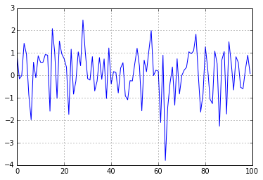

A Quick Example
~~~~~~~~~~~~~~~

Here is a quick example of what it looks like. I am writing this in my
notebook file by the way (using a Mardown cell).

.. code:: python

    # have to comment out the magic IPython functions because of a bug
    #%pylab inline
    import numpy as np
    import pandas as pd
.. code:: python

    print np.random.randn(20)

.. parsed-literal::
    :class: pynb-result

    [-0.81256785 -1.16630768  0.27555802  0.57729188 -0.64691411  0.62288591
      0.27943851  0.10512695  0.23808598 -1.45293996 -0.24394825 -0.14631097
      1.56377514 -0.87629984  1.64059433 -0.10259616  0.84435183  0.11718899
     -0.66617413 -0.81800771]

Mardown
~~~~~~~

IPython currently supports markdown cells. These are converted to the
appropriate .rst type by the klink helper function (h1, h2, p, etc.).
The function calls IPython's nbconvert with the **--to rst** option. You
will need an up-to-date version of pandoc for this to work properly.

.. code:: python

    pd.Series(np.random.randn(100)).plot()

.. parsed-literal::
    :class: pynb-result

    <matplotlib.axes.AxesSubplot at 0x7f28246381d0>

