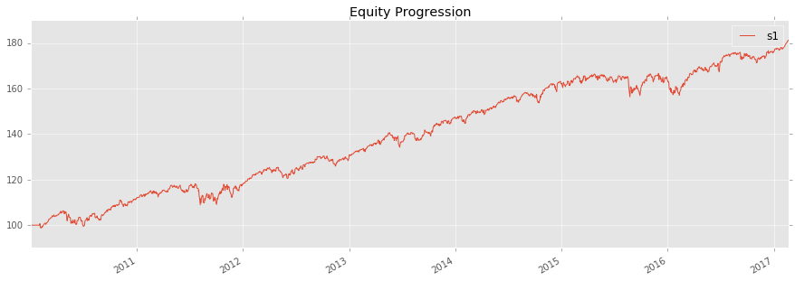
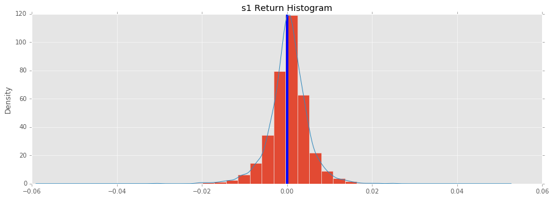
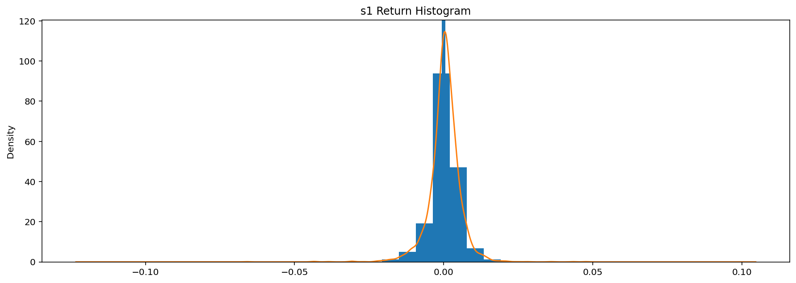

.. code:: python

    # to see our plots
    # %pylab inline
    
    import bt
                
A Simple Strategy Backtest
~~~~~~~~~~~~~~~~~~~~~~~~~~

Let's create a simple strategy. We will create a monthly rebalanced, long-only strategy where we place equal weights on each asset in our universe of assets.

First, we will download some data. By default, :func:`bt.get (alias for ffn.get) <ffn.data.get>` downloads the Adjusted Close from Yahoo! Finance. We will download some data starting on January 1, 2010 for the purposes of this demo.
                
.. code:: python

    # fetch some data
    data = bt.get('spy,agg', start='2010-01-01')
    print data.head()

.. parsed-literal::
    :class: pynb-result

                   spy    agg
    Date                     
    2010-01-04  103.44  90.61
    2010-01-05  103.71  91.02
    2010-01-06  103.79  90.97
    2010-01-07  104.23  90.86
    2010-01-08  104.57  90.92
    
    [5 rows x 2 columns]

                
Once we have our data, we will create our strategy. The :class:`Strategy <bt.core.Strategy>` object contains the strategy logic by combining various :class:`Algos <bt.core.Algo>`. 
                
.. code:: python

    # create the strategy
    s = bt.Strategy('s1', [bt.algos.RunMonthly(),
                           bt.algos.SelectAll(),
                           bt.algos.WeighEqually(),
                           bt.algos.Rebalance()])
                
Finally, we will create a :class:`Backtest <bt.backtest.Backtest>`, which is the logical combination of a strategy with a data set.

Once this is done, we can run the backtest and analyze the results.
                
.. code:: python

    # create a backtest and run it
    test = bt.Backtest(s, data)
    res = bt.run(test)
                
Now we can analyze the results of our backtest. The :class:`Result <bt.backtest.Result>` object is a thin wrapper around `ffn.GroupStats <http://pmorissette.github.io/ffn/ffn.html#ffn.core.GroupStats>`__ that adds some helper methods.
                
.. code:: python

    # first let's see an equity curve
    res.plot()

.. code:: python

    # ok and what about some stats?
    res.display()

.. parsed-literal::
    :class: pynb-result

    Stat                 s1
    -------------------  ----------
    Start                2010-01-04
    End                  2014-06-27
    
    Total Return         55.58%
    Daily Sharpe         1.33
    CAGR                 10.38%
    Max Drawdown         -7.83%
    
    MTD                  1.03%
    3m                   4.19%
    6m                   5.72%
    YTD                  5.48%
    1Y                   13.97%
    3Y (ann.)            10.60%
    5Y (ann.)            10.38%
    10Y (ann.)           10.38%
    Since Incep. (ann.)  10.38%
    
    Daily Sharpe         1.33
    Daily Mean (ann.)    10.17%
    Daily Vol (ann.)     7.62%
    Daily Skew           -0.38
    Daily Kurt           4.19
    Best Day             2.48%
    Worst Day            -3.11%
    
    Monthly Sharpe       1.60
    Monthly Mean (ann.)  10.25%
    Monthly Vol (ann.)   6.40%
    Monthly Skew         -0.13
    Monthly Kurt         0.24
    Best Month           5.70%
    Worst Month          -3.40%
    
    Yearly Sharpe        2.07
    Yearly Mean          8.71%
    Yearly Vol           4.22%
    Yearly Skew          0.75
    Yearly Kurt          -1.83
    Best Year            14.10%
    Worst Year           5.23%
    
    Avg. Drawdown        -0.75%
    Avg. Drawdown Days   12.04
    Avg. Up Month        1.76%
    Avg. Down Month      -1.44%
    Win Year %           100.00%
    Win 12m %            100.00%

.. code:: python

    # ok and how does the return distribution look like?
    res.plot_histogram()

.. code:: python

    # and just to make sure everything went along as planned, let's plot the security weights over time
    res.plot_security_weights()

                
Modifying a Strategy
~~~~~~~~~~~~~~~~~~~~

Now what if we ran this strategy weekly and also used some risk parity style approach by using weights that are proportional to the inverse of each asset's volatility? Well, all we have to do is plug in some different algos. See below:
                
.. code:: python

    # create our new strategy
    s2 = bt.Strategy('s2', [bt.algos.RunWeekly(),
                            bt.algos.SelectAll(),
                            bt.algos.WeighInvVol(),
                            bt.algos.Rebalance()])
    
    # now let's test it with the same data set. We will also compare it with our first backtest.
    test2 = bt.Backtest(s2, data)
    res2 = bt.run(test, test2)
    
    res2.plot()

.. image:: _static/intro_13_0.png
    :class: pynb

.. code:: python

    res2.display()

.. parsed-literal::
    :class: pynb-result

    Stat                 s1          s2
    -------------------  ----------  ----------
    Start                2010-01-04  2010-01-04
    End                  2014-06-27  2014-06-27
    
    Total Return         53.57%      29.24%
    Daily Sharpe         1.29        1.73
    CAGR                 10.06%      5.90%
    Max Drawdown         -7.83%      -4.06%
    
    MTD                  1.03%       0.37%
    3m                   4.19%       2.71%
    6m                   5.72%       4.28%
    YTD                  5.48%       4.18%
    1Y                   13.97%      8.49%
    3Y (ann.)            10.60%      5.42%
    5Y (ann.)            10.06%      5.90%
    10Y (ann.)           10.06%      5.90%
    Since Incep. (ann.)  10.06%      5.90%
    
    Daily Sharpe         1.29        1.73
    Daily Mean (ann.)    9.88%       5.79%
    Daily Vol (ann.)     7.68%       3.35%
    Daily Skew           -0.39       -0.18
    Daily Kurt           4.01        3.21
    Best Day             2.48%       1.20%
    Worst Day            -3.11%      -1.13%
    
    Monthly Sharpe       1.62        2.19
    Monthly Mean (ann.)  10.41%      6.11%
    Monthly Vol (ann.)   6.41%       2.79%
    Monthly Skew         -0.15       -0.64
    Monthly Kurt         0.22        0.17
    Best Month           5.70%       1.90%
    Worst Month          -3.40%      -1.49%
    
    Yearly Sharpe        2.07        3.54
    Yearly Mean          8.71%       4.95%
    Yearly Vol           4.21%       1.40%
    Yearly Skew          0.75        1.81
    Yearly Kurt          -1.83       3.30
    Best Year            14.10%      7.01%
    Worst Year           5.23%       4.00%
    
    Avg. Drawdown        -0.77%      -0.37%
    Avg. Drawdown Days   12.33       11.13
    Avg. Up Month        1.78%       0.85%
    Avg. Down Month      -1.44%      -0.66%
    Win Year %           100.00%     100.00%
    Win 12m %            100.00%     97.67%

