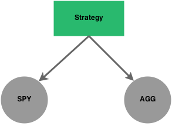
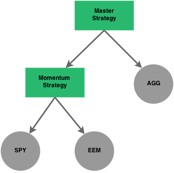

The Tree Structure
==================

Overview
--------

In addition to the concept of :class:`Algos <bt.core.Algo>` and :class:`AlgoStacks <bt.core.AlgoStack>`, a tree structure lies 
at the heart of the framework.  It allows you to mix and match securities and strategies in order to express 
your sophisticated trading ideas.  Here is a very simple diagram to help explain this concept:



This diagram represents the strategy we tested in the :doc:`overview example <index>`. A simple :class:`strategy <bt.core.Strategy>` 
with two children that happen to be :class:`securities <bt.core.SecurityBase>`. However, children nodes don't have to be
securities. They can also be strategies. This concept is very powerful as it
allows you to combine strategies together and allocate capital dynamically
between different strategies as time progresses using sophisticated allocation
logic. This is similar to what hedge funds do - they have a portfolio of strategies and dynamically allocate capital
according to a set of rules. 

For example, say we didn't mind having a passive bond allocation (AGG in the
above graph), but we wanted to swap out the equity portion (SPY) for something a
little more sophisticated. In this case, we will swap out the SPY node for another strategy.
This strategy could be a momentum strategy that attempts to pick the best
performing ETF every month (to keep it simple, let's say it picks either the SPY
or the EEM based on total return over the past 3 months).

Here is the updated graph:



This approach allows you to build complex systems even though all of the building
blocks may be relatively simple. Hopefully you can see how powerful this can be
when designing and testing quantitative strategies.

Oh and here's the code for the second example - not much more complex:

.. code:: python

    import bt

    # create the momentum strategy - we will specify the children (3rd argument)
    # to limit the universe the strategy can choose from
    mom_s = bt.Strategy('mom_s', [bt.algos.RunMonthly(),
                                  bt.algos.SelectAll(),
                                  bt.algos.SelectMomentum(1),
                                  bt.algos.WeighEqually(),
                                  bt.algos.Rebalance()],
                        ['spy', 'eem'])

    # create the parent strategy - this is the top-most node in the tree
    # Once again, we are also specifying  the children. In this case, one of the
    # children is a Security and the other is a Strategy.
    parent = bt.Strategy('parent', [bt.algos.RunMonthly(),
                                    bt.algos.SelectAll(),
                                    bt.algos.WeighEqually(),
                                    bt.algos.Rebalance()],
                        [mom_s, 'agg'])

    # create the backtest and run it
    t = bt.Backtest(parent, data)
    r = bt.run(t)

For even more sophisticated strategies, sub-strategies can be dynamically 
created by constructing them with the appropriate parent argument. The code below
is equivalent to the example above, but knowledge of the sub-strategy is not
needed at construction time of the parent:

.. code:: python

    # create the parent strategy first - this is the top-most node in the tree
    # To start, there is only one child, which is a Security
    parent = bt.Strategy('parent', [bt.algos.RunMonthly(),
                                    bt.algos.SelectAll(),
                                    bt.algos.WeighEqually(),
                                    bt.algos.Rebalance()],
                        ['agg'])
       
    # Create the momentum strategy dynamically - we will specify the children 
    # (3rd argument) to limit the universe the strategy can choose from
    mom_s = bt.Strategy('mom_s', [bt.algos.RunMonthly(),
                                  bt.algos.SelectAll(),
                                  bt.algos.SelectMomentum(1),
                                  bt.algos.WeighEqually(),
                                  bt.algos.Rebalance()],
                        ['spy', 'eem'], parent = parent)

    # create the backtest and run it
    t = bt.Backtest(parent, data)
    r = bt.run(t)

While this seems like a trivial example, it enables algos to create sub-strategies
on-the-fly (based on market conditions/triggers) and register them to the target.
Each of these sub-strategies will have its own algos and performance measurement.


Types
-----
The base class for nodes in the tree is :class:`Node <bt.core.Node>`, and these
can be either of type :class:`StrategyBase <bt.core.StrategyBase>` or 
:class:`SecurityBase <bt.core.SecurityBase>`.

Each node offers an interface to the **current values** of many quantities of
interest (price, value, weight, etc), which is useful for building Algos. 
Furthermore, they also offer an interface to the **history** of these quantities, 
which is useful for building **path-dependent** algos as well as for drilling 
into the strategy behavior *after* the backtest has run. 

For more information, see the APIs for :class:`Node <bt.core.Node>`,
:class:`SecurityBase <bt.core.SecurityBase>` and :class:`StrategyBase <bt.core.StrategyBase>`.

There are two main sub-types of :class:`StrategyBase <bt.core.StrategyBase>`:
  * :class:`Strategy <bt.core.Strategy>`: Market-value weighted strategy based on  
    :class:`Algos <bt.core.Algo>`.
  * :class:`FixedIncomeStrategy <bt.core.FixedIncomeStrategy>`: Notional weighted
    strategy based on :class:`Algos <bt.core.Algo>`.

There are also two main sub-types of :class:`SecurityBase <bt.core.SecurityBase>`:
  * :class:`Security <bt.core.Security>`: Standard security. If used within a
    :class:`FixedIncomeStrategy <bt.core.FixedIncomeStrategy>`, its notional weight
    is equal to market value. i.e. common stock.   
  * :class:`CouponPayingSecurity <bt.core.CouponPayingSecurity>`: A security that
    pays regular or irregular cashflows, and can have (asymmetric) holding costs.
    i.e. a corporate bond with funding and repo costs, or an unfunded swap. 

When using :class:`FixedIncomeStrategy <bt.core.FixedIncomeStrategy>`, 
there are additional security types that are helpful due to the different
treatment of their notional weight in the portfolio. These have no effect in a standard 
:class:`Strategy <bt.core.Strategy>`.
  * :class:`FixedIncomeSecurity <bt.core.FixedIncomeSecurity>`: A
    :class:`Security <bt.core.Security>` for which position (rather than market value)
    will be used as the notional weight, i.e. a zero-coupon bond.
  * :class:`HedgeSecurity <bt.core.HedgeSecurity>`: A :class:`Security <bt.core.Security>`
    for which the notional weight is zero, i.e. an ETF hedge in a bond strategy.
  * :class:`CouponPayingHedgeSecurity <bt.core.CouponPayingHedgeSecurity>`:
    A :class:`CouponPayingSecurity <bt.core.CouponPayingSecurity>`
    for which the notional weight is zero, i.e. a rates swap hedge in a CDS strategy.
  
  
As in the examples, a list of strings can be passed to the strategy constructors,
which will be automatically converted to instances of :class:`Security <bt.core.Security>`
when needed. For more fine-grained control over which security types are used
(or over other arguments like the ```multiplier```), explicitly construct the
security nodes yourself before passing them to the strategy.

    

